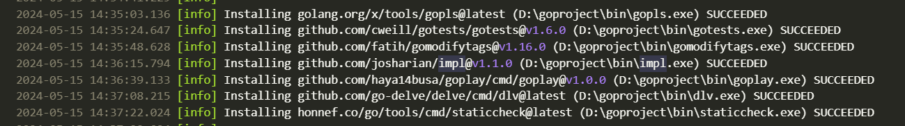

# 1 Go env配置

配置env：

```bash
go env -w GO111MODULE=on
go env -w GOPROXY=https://goproxy.cn,direct
# 或
go env -w GOPROXY=https://goproxy.io,direct
```

## 运行 go env -w报错

1. 运行 `go env -w GOPATH=...` 报错


注意这里：
用户变量和系统变量里的GOPATH冲突了

----

vscode读取env并配置成功了：


