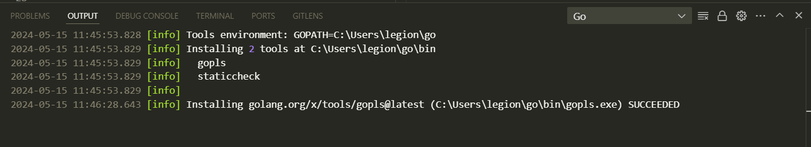
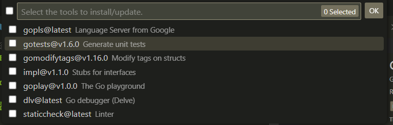
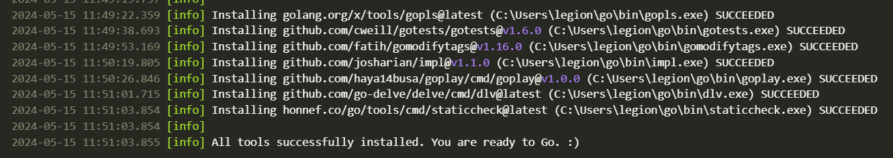
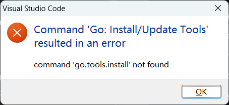

# 1 Go IDE配置

## VsCode

### 下载安装vscode

这里不赘述了

### 安装插件

ctrl shift p 执行：`Go::Install/Update`

执行结果如下：

接下来就是安装对应的工具，全部勾选就行

下载完成：

应该就是成功了

### 插件go配置问题：

没有配置好`go env`

配置好之后重启vscode，重新执行命令

ctrl shift p

`Go::Install/Update`

### 参考链接

https://blog.csdn.net/qq_41048567/article/details/127681203

## GoLand
