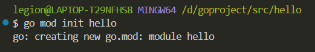

# 2 Go 新建工程

## 新建工程目录

```bash
cd [your go project path]
```

## 使用Go Modules初始化并管理依赖

```bash
go mod init [your project name]
```



## 参考链接

https://www.topgoer.com/%E5%BC%80%E5%8F%91%E7%8E%AF%E5%A2%83/%E7%AC%AC%E4%B8%80%E4%B8%AAgo%E7%A8%8B%E5%BA%8F.html

https://www.topgoer.com/go%E5%9F%BA%E7%A1%80/Go%E8%AF%AD%E8%A8%80%E7%9A%84%E4%B8%BB%E8%A6%81%E7%89%B9%E5%BE%81.html
中的1.1.8