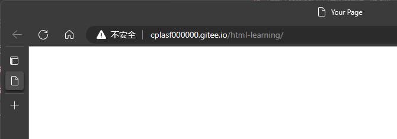
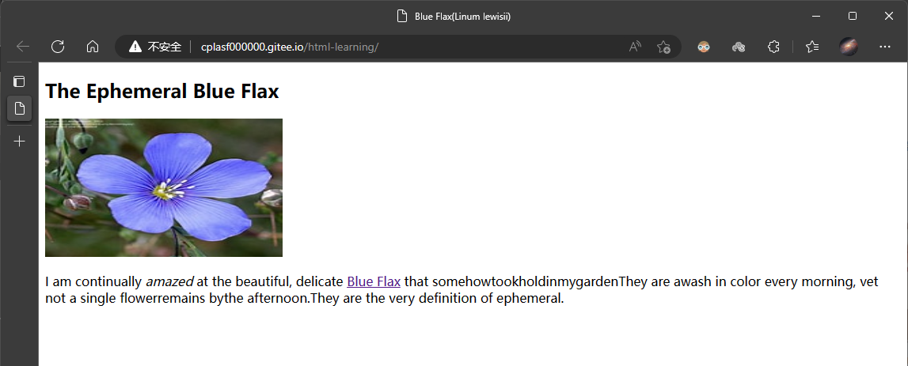

# 1.2 基本的HTML页面

先来看个最简单的例子：

```html
<!DOCTYPE html>
    <html lang="en">
        <title charset="utf-8">
            Your Page
        </title>
    </html>
</html>
```

<!-- @import "./html.codes/01.html" -->



## 网页的顶部和头部

`<!DOCTYPE html>`部分即DOCTYPE元素位于顶部，告诉浏览器这是html

接下来是html元素：`<html lang="en">`

```html
<!DOCTYPE html>
    <html lang="en">
        <head>
            <meta charset="utf-8" />
            <title>Blue Flax(Linum lewisii)</title>
        </head>
        
        <body>
            <article>
                <h1>The Ephemeral Blue Flax</h1>
                
            
                <p>I am continually <em>amazed</em> at the beautiful, delicate <a href=" "rel="external"title="Learn more about Blue Flax">Blue Flax</a> that somehowtookholdinmygardenThey are awash in color every morning, vet not a single flowerremains bythe afternoon.They are the very definition of ephemeral.</p>
            </article>
        </body>
    </html>
</html>

```


