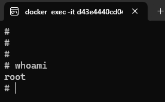
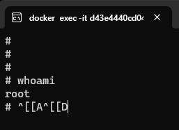

# Docker命令行美化问题

从镜像启动容器后，发现命令行提示很丑，而且方向键用不了：





解决办法：

```bash
bash
```

然后就可以转为bash了

然后bash还是有点丑

编辑 ~/.bashrc文件：

```bash
sudo vim ~/.bashrc

# 在最后添加如下代码

# get current branch in git repo
function parse_git_branch() {
        BRANCH=`git branch 2> /dev/null | sed -e '/^[^*]/d' -e 's/* \(.*\)/\1/'`
        if [ ! "${BRANCH}" == "" ]
        then
                STAT=`parse_git_dirty`
                echo "[${BRANCH}${STAT}]"
        else
                echo ""
        fi
}


# get current status of git repo
function parse_git_dirty {
        status=`git status 2>&1 | tee`
        dirty=`echo -n "${status}" 2> /dev/null | grep "modified:" &> /dev/null; echo "$?"`
        untracked=`echo -n "${status}" 2> /dev/null | grep "Untracked files" &> /dev/null; echo "$?"`
        ahead=`echo -n "${status}" 2> /dev/null | grep "Your branch is ahead of" &> /dev/null; echo "$?"`
        newfile=`echo -n "${status}" 2> /dev/null | grep "new file:" &> /dev/null; echo "$?"`
        renamed=`echo -n "${status}" 2> /dev/null | grep "renamed:" &> /dev/null; echo "$?"`
        deleted=`echo -n "${status}" 2> /dev/null | grep "deleted:" &> /dev/null; echo "$?"`
        bits=''
        if [ "${renamed}" == "0" ]; then
                bits=">${bits}"
        fi
        if [ "${ahead}" == "0" ]; then
                bits="*${bits}"
        fi
        if [ "${newfile}" == "0" ]; then
                bits="+${bits}"
        fi
        if [ "${untracked}" == "0" ]; then
                bits="?${bits}"
        fi
        if [ "${deleted}" == "0" ]; then
                bits="x${bits}"
        fi
        if [ "${dirty}" == "0" ]; then
                bits="!${bits}"
        fi
        if [ ! "${bits}" == "" ]; then
                echo " ${bits}"
        else
                echo ""
        fi
}

export PS1='\[\e]0;\w\a\]\n\[\e[32m\]\u@\h \[\e[33m\]\w \[\033[01;36m\]$(parse_git_branch)\[\033[00m\]\$\[\e[0m\]'
```

如果主机名字太长，那么可将上面最后一行的export改成：

```bash
export PS1='\[\033[01;32m\]\u:\w\[\033[01;36m\]$(parse_git_branch)\[\033[00m\] \$'
```

## 参考资料

[Git设置脚本](../../../Git/setting/Git设置脚本.md)
[Bash美化-git bash](../../../../04%20Script/shell/bash/Bash美化.md)
