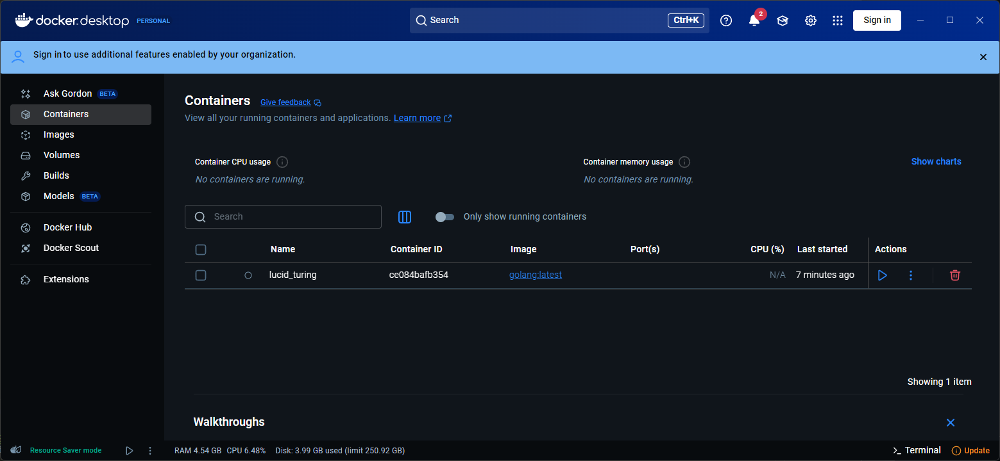

# DockerDesktop启动容器一启动就退出问题

如图，在Docker Desktop点击start容器，然后马上就退出了

## 可能的情况

这个容器创建之后可能更新了Docker Desktop，这个时候只能重新从镜像创建一个新的容器了
**注意：**
重新创建必须得用`dockers run`命令，否则可能创建后还是无法启动，例如在Docker desktop GUI里创建仍然是无法启动的

这就告诉我们在进行Docker更新之前一定要将所有docker container进行commit
