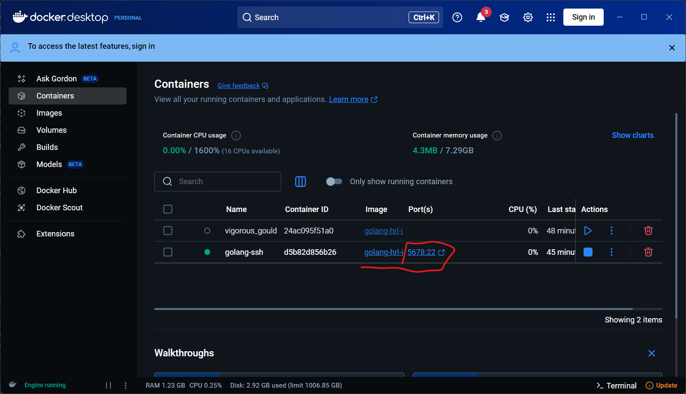

# 如何ssh登录Docker镜像容器

## 首先要重新创建一个容器并绑定端口

```bash
docker run -it --name golang-ssh -p 5678:22 -d golang-hrl
# 用 golang-hrl 镜像创建一个名为 golang-ssh 的容器并开放端口 宿主机端口5678：容器端口22
```

如果创建成功在docker-desktop的容器列表里应该能够看到：



## 然后进入该容器的terminal：

```bash
# docker exec -it {containerID_or_name} bash
docker exec -it golang-ssh /bin/bash
```

## 下载安装ssh

在 容器里运行：

```bash
apt-get install -y ssh
```

配置ssh：

```bash
vim /etc/ssh/sshd_config
```

修改 port
文件的前幾行有個 Port 可以設定，預設是 22
這個 port 是對應到上述的 {container_ssh_port}

修改授權
將文件中的 PasswordAuthentication XXX 取消註解並修改成 PasswordAuthentication yes
啟用 root 登入授權
將文件中的 PermitRootLogin XXX 取消註解並修改成 PermitRootLogin yes

----

其实这里也可以创建新用户名来登录，那么就不用root里，但是这样就多了一步比较麻烦

----

設定使用者密碼
因為 container 預設使用者是 root，而我們也想讓之後連進來的權限為 root，但又不想讓任何知道 ip 和 port 的外部人員可以任意連進來，所以需要設定 container 內 root 的密碼

```bash
passwd root
```

设置完之后要重启容器

进入容器之后重启ssh：

```bash
docker exec -it {containerID_or_name} bash
/etc/init.d/ssh restart
```

----

这个进入容器之后每次都要重启ssh的应该可以优化一下，容器启动就启动ssh

----

## 配置好之后登录

### 主机登录容器

```bash
ssh root@127.0.0.1 -p 5678
```

### 同一局域网登录本机的容器

首先确保登录的机器能够ping通主机的ip，例如主机ip为：192.168.0.111

```bash
ssh root@192.168.0.111 -p 5678
```

那么应该就可以了

## 参考资料

https://hackmd.io/@jimmy801/SSH_docker
