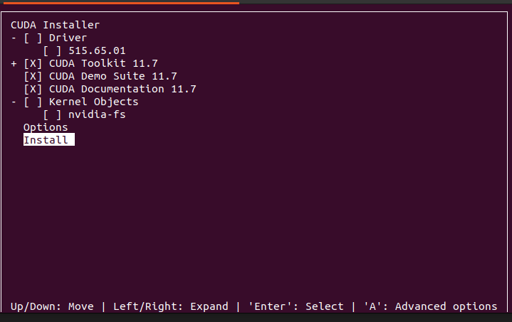

# nvidia cuda的安装

## windows

## WSL2

[我自己的WSL2安装cuda笔记](../../../02%20OperationSystem%E6%93%8D%E4%BD%9C%E7%B3%BB%E7%BB%9F/Linux/WSL/WSL%E5%A6%82%E4%BD%95%E5%AE%89%E8%A3%85Cuda.md)

## Linux

### ubuntu18

### ubuntu20

### ubuntu22

cuda在Ubuntu22上能装的最低版本是11.7：

```bash
wget https://developer.download.nvidia.com/compute/cuda/11.7.1/local_installers/cuda_11.7.1_515.65.01_linux.run
sudo sh cuda_11.7.1_515.65.01_linux.run
```

*这两个命令就在官网的下载界面可以找到*

第一个对话框输入`accept`回车即可

第二个对话框，由于我是先安装了驱动然后再安装cuda的（一般都是这样的吧）
这里注意要把安装driver的选项取消，否则安装的驱动会和原来的冲突导致出现问题



出现以下界面输出说明安装成功了，接下来该去配置环境变量了

```bash
===========
= Summary =
===========

Driver:   Not Selected
Toolkit:  Installed in /usr/local/cuda-11.7/

Please make sure that
 -   PATH includes /usr/local/cuda-11.7/bin
 -   LD_LIBRARY_PATH includes /usr/local/cuda-11.7/lib64, or, add /usr/local/cuda-11.7/lib64 to /etc/ld.so.conf and run ldconfig as root

To uninstall the CUDA Toolkit, run cuda-uninstaller in /usr/local/cuda-11.7/bin
***WARNING: Incomplete installation! This installation did not install the CUDA Driver. A driver of version at least 515.00 is required for CUDA 11.7 functionality to work.
To install the driver using this installer, run the following command, replacing <CudaInstaller> with the name of this run file:
    sudo <CudaInstaller>.run --silent --driver

Logfile is /var/log/cuda-installer.log
```

配置环境变量：

```bash
vim ~/.bashrc
# 在文件里加入
# nvidia cuda env
export CUDA_HOME=/usr/local/cuda
export PATH=$PATH:$CUDA_HOME/bin
export LD_LIBRARY_PATH=/usr/local/cuda/lib64${LD_LIBRARY_PATH:+:${LD_LIBRARY_PATH}}
```

```bash
vim ~/.bashrc
# 在文件里加入
# nvidia cuda env
export CUDA_HOME=/usr/local/cuda-11.7
export PATH=$PATH:$CUDA_HOME/bin
export LD_LIBRARY_PATH=/usr/local/cuda-11.7/lib64${LD_LIBRARY_PATH:+:${LD_LIBRARY_PATH}}
```

验证环境变量配置成功：
新开一个terminal窗口，输入

```bash
nvcc -V
# 输出以下内容则成功
vcc: NVIDIA (R) Cuda compiler driver
Copyright (c) 2005-2022 NVIDIA Corporation
Built on Wed_Jun__8_16:49:14_PDT_2022
Cuda compilation tools, release 11.7, V11.7.99
Build cuda_11.7.r11.7/compiler.31442593_0
```

https://blog.csdn.net/zxdd2018/article/details/127705627

## cuda 11.1

pcl 1.13.1仅支持cuda 11.1

```bash
wget https://developer.download.nvidia.com/compute/cuda/11.1.1/local_installers/cuda_11.1.1_455.32.00_linux.run
sudo sh cuda_11.1.1_455.32.00_linux.run
```

接下来尝试在ubuntu22.04上安装cuda-11.1

gcc版本不对，可能要降gcc版本
