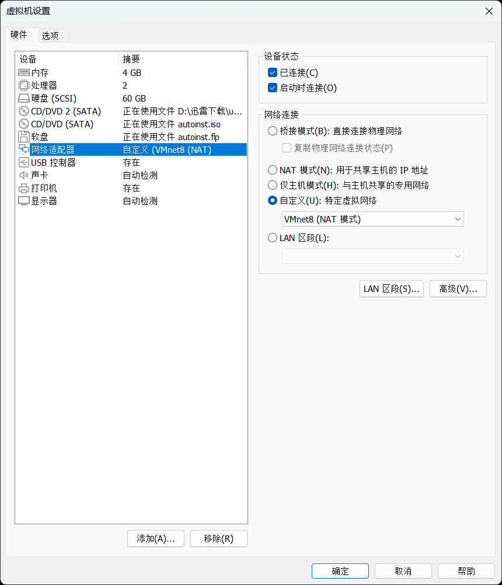
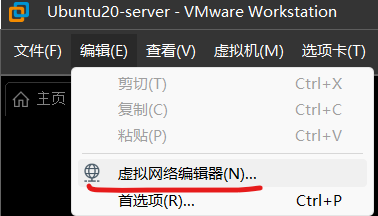
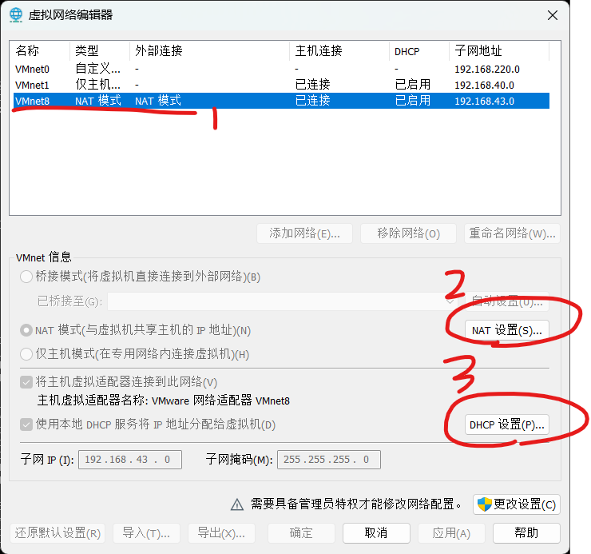
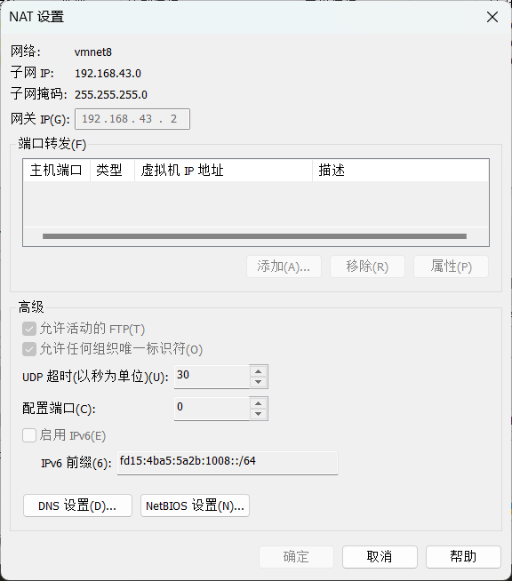
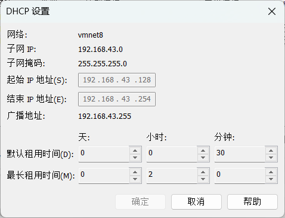
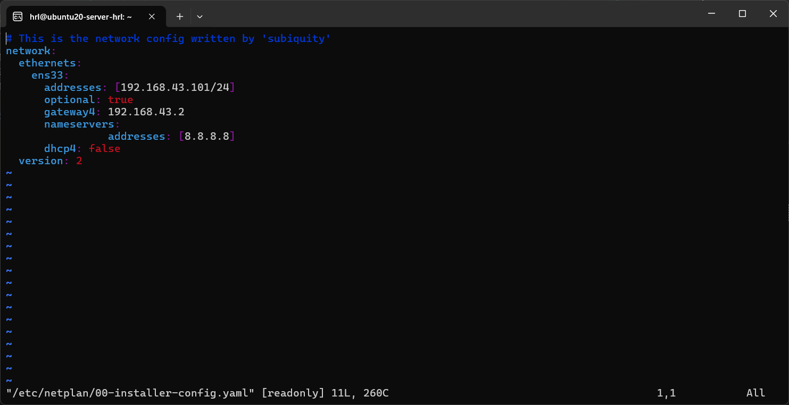

# VMware多虚拟机网络配置

配置目标：
1. 虚拟机能够ping通主机（既然能够ping同主机，那么主机所在局域网的其他设备也能够ping通）
2. 虚拟机之间能够ping通

<!-- ## 设置主机网络共享

这个可能不是必要的 -->

## 1 VMware虚拟机网络设置NAT



## 2 VMware 虚拟网络设置





Nat设置：



这里的 nat 设置里的IP地址不用改，等下修改静态ip的时候这个就是网关的地址

Dhcp设置：



这里的 192.168.43.128~254 不用管

## 3 VMware设置ip地址

这里以ubuntu 20-server为例

使用 netplan 工具来修改ip地址

```bash
sudo vim /etc/netplan/00-xxx.yaml
# 我这里是 00-install-config.yaml
```

打开后：

```bash
# This is the network config written by 'subiquity'
network:
  ethernets:
    ens33:
      dhcp4: true
  version: 2
```

假设我要修改：
1. ip 地址为 192.168.43.101
2. 网关为 192.168.43.2 （1和2都是根据刚才的 虚拟网络设置来的）
3. dns 8.8.8.8 （这个貌似是根据宿主机来的？）

那么修改后的如下，自行对照一下就知道怎么改了：

```bash
# This is the network config written by 'subiquity'
network:
  ethernets:
    ens33:
      addresses: [192.168.43.101/24]
      optional: true
      gateway4: 192.168.43.2
      nameservers:
                addresses: [8.8.8.8]
      dhcp4: false
  version: 2
```

保存修改后，应用：

```bash
sudo netplan try
# 然后回车确认就行了
```

----

然后就可以用ssh登录了：



然后文件传输的话，既然都能用ssh了，vmtool用不了就直接用scp命令吧

## 宿主机外一个物理设备想同问宿主机上的虚拟机

windows需要设置 入站规则 其实就相当于一个端口转发

[参考链接](https://blog.csdn.net/u010201661/article/details/135152907)

## 遇到问题的解决方案

## ip地址修改后未生效

重启大法好 重启虚拟机

不行就重启网卡：

```bash
sudo nmcli networking off
sudo nmcli networking on
```

## 参考链接

https://blog.csdn.net/zhouchen1998/article/details/124116729
