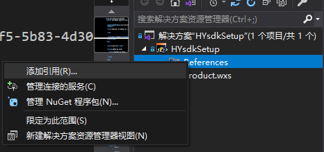
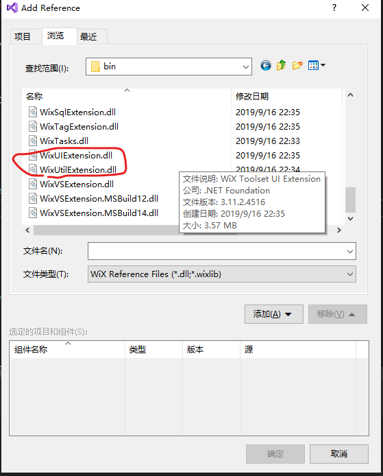

# Wix unresolved解决办法

## `<UIRef Id="WixUI_Mondo"/>` unresolved

```xml
<UIRef Id="WixUI_Mondo"/>
```

上述代码报错;

```bash
unresolved <UIRef Id="WixUI_Mondo"/>
```

### 解决办法

添加引用：



找到`C:\Program Files (x86)\WiX Toolset v3.11\bin`


