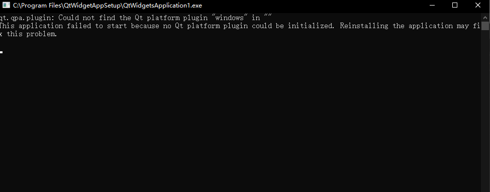

# Wix 打包用vs写的Qt程序运行出错

## 报错



## 原因分析

还是Qt的dll没有添加全

参考代码（MyPick and QtWidgetZH）

```xml
<ComponentRef Id="QT"/>
      
<ComponentRef Id="QTBEARER"/>
<ComponentRef Id="QTICONENGINE"/>
<ComponentRef Id="QTIMAGEFORMAT"/>
<ComponentRef Id="QTPLATFORM"/>
<ComponentRef Id="QTSTYLES"/>
```

----

```xml
<Directory Id="BEARERFOLDER" Name="bearer" FileSource="$(env.QT_ROOT)/plugins/bearer">
            <Component Id="QTBEARER" Guid="{3D0EAB51-0AE9-4DE5-8E4F-FB0E0FD0372B}" Win64="yes">
              <File Name="qgenericbearer.dll"/>
            </Component>
          </Directory>
          
          <Directory Id="ICONENGINEFOLDER" Name="iconengines" FileSource="$(env.QT_ROOT)/plugins/iconengines">
            <Component Id="QTICONENGINE" Guid="{2F143F6C-F055-4524-9491-95646816B40B}" Win64="yes">
              <File Name="qsvgicon.dll"/>
            </Component>
          </Directory>
          
          <Directory Id="IMAGEFORMATFOLDER" Name="imageformats" FileSource="$(env.QT_ROOT)/plugins/imageformats">
            <Component Id="QTIMAGEFORMAT" Guid="{92F0066C-20FF-47C1-BC13-4749D255AC45}" Win64="yes">
              <File Name="qgif.dll"/>
              <File Name="qicns.dll"/>
              <File Name="qico.dll"/>
              <File Name="qjpeg.dll"/>
              <File Name="qsvg.dll"/>
              <File Name="qtga.dll"/>
              <File Name="qtiff.dll"/>
              <File Name="qwbmp.dll"/>
              <File Name="qwebp.dll"/>
            </Component>
          </Directory>
          
          <Directory Id="PLATFORMFOLDER" Name="platforms" FileSource="$(env.QT_ROOT)/plugins/platforms">
            <Component Id="QTPLATFORM" Guid="{3492315B-4D4C-4EFE-9A1C-A0E84CE5DB35}" Win64="yes">
              <File Name="qwindows.dll"/>
            </Component>
          </Directory>
          
           <Directory Id="STYLESFOLDER" Name="styles" FileSource="$(env.QT_ROOT)/plugins/styles">
            <Component Id="QTSTYLES" Guid="{DA927933-3B04-4A0D-B218-5AF54FCF2F9F}" Win64="yes">
              <File Name="qwindowsvistastyle.dll"/>
            </Component>
          </Directory>
```

----

```xml
<!--安装QT-->
  <Fragment>
    <DirectoryRef Id="INSTALLFOLDER" >
      <Component Id="QT" Guid="{E5D9B4A7-8AFC-488B-891A-DC65A6885E7D}" Win64="yes">
        <File Id="Qt5Core.dll" Source="$(env.QT_ROOT)/bin/Qt5Core.dll" KeyPath="yes" Checksum="yes"/>
        <File Id="Qt5Gui.dll" Source="$(env.QT_ROOT)/bin/Qt5Gui.dll" Checksum="yes"/>
        <File Id="Qt5Widgets.dll" Source="$(env.QT_ROOT)/bin/Qt5Widgets.dll" Checksum="yes"/>
        <File Id="Qt5Network.dll" Source="$(env.QT_ROOT)/bin/Qt5Network.dll" Checksum="yes"/>
        <File Id="Qt5Designer.dll" Source="$(env.QT_ROOT)/bin/Qt5Designer.dll" Checksum="yes"/>
        <File Id="Qt5Xml.dll" Source="$(env.QT_ROOT)/bin/Qt5Xml.dll" Checksum="yes"/>
        <File Id="Qt5Svg.dll" Source="$(env.QT_ROOT)/bin/Qt5Svg.dll" Checksum="yes"/>
      </Component>
    </DirectoryRef>
  </Fragment>
```
