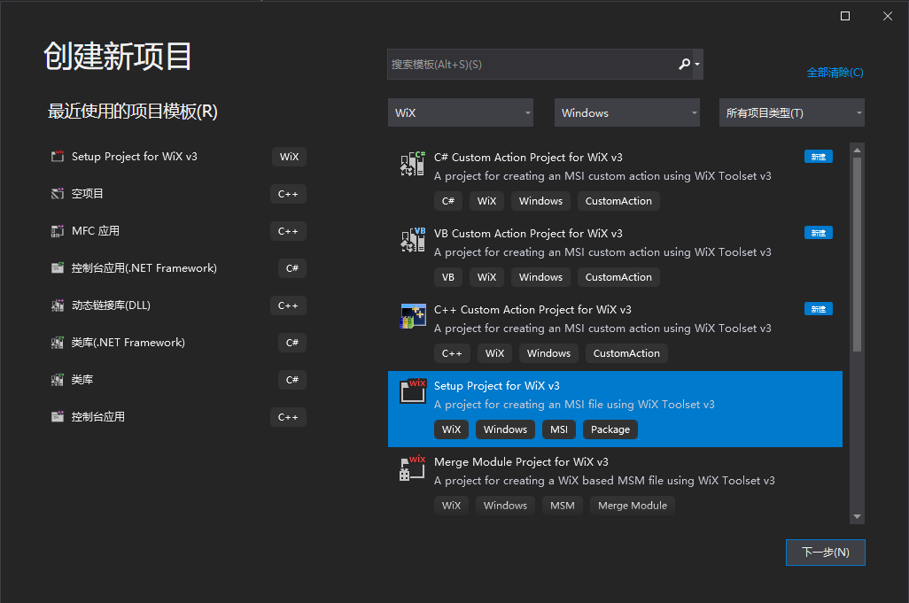

# Wix如何在vs2019里打包程序

参考这篇[文章][文章]的第四部分

[文章]:https://www.cnblogs.com/chenyingzuo/p/12164131.html

## 安装vs2019插件

下载`Votive2019.vsix`插件并安装。

注意安装的时候不能开启vs，必须关掉所有vs相关的进程。

## 在vs2019里创建Wix Setup Project

新建工程 如图：

