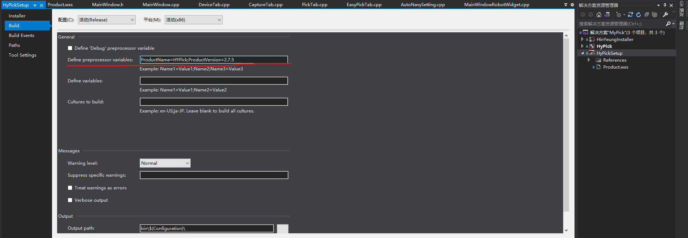
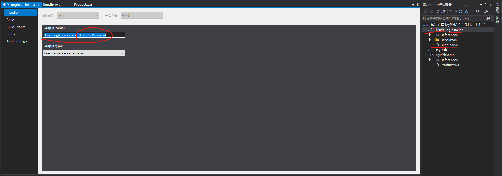
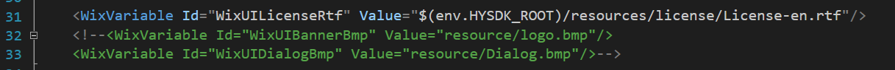

# Wix如何设置变量

Wix里的变量有两种：
1. var
2. env

## var变量

var变量是在设置里定义的

如图：


根据提示可知
定义了

```bash
ProductName=HYPick;
ProductVision=2.7.5;
```

除此之外这种定义变量的方式还可以在设置里的Installer里访问：



## env变量

wix可以通过这种方式直接访问系统的环境变量


