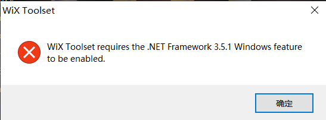

# Wix安装遇到的问题

## 问题1

### 问题描述

### 解决方案

https://docs.microsoft.com/zh-cn/dotnet/framework/install/dotnet-35-windows?WT.mc_id=dotnet-35129-website

由于我这是win10系统，所以就直接在控制面板里通过系统更新来安装`.Net framework 3.5`了
