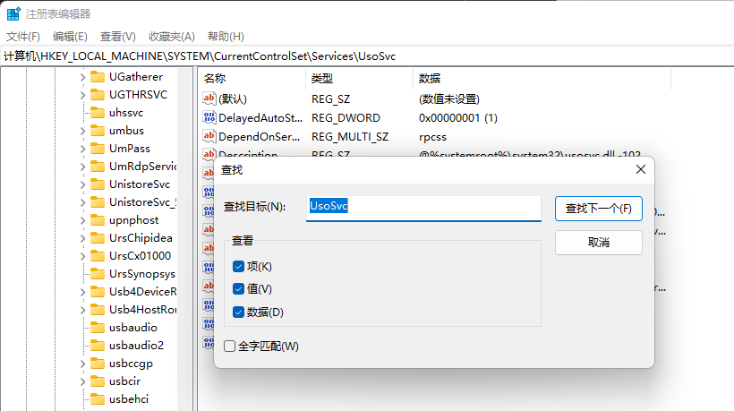
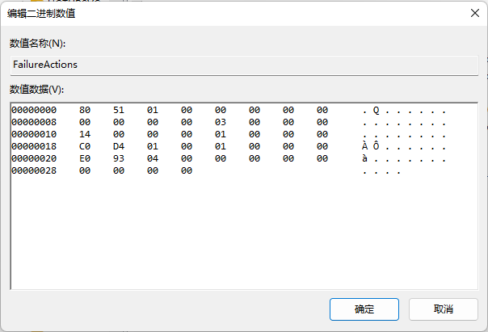
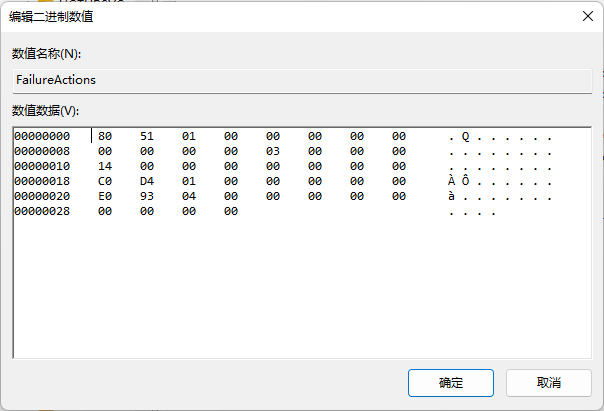
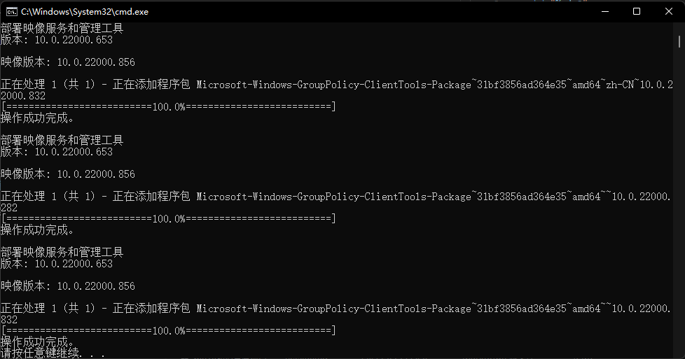

# win10如何关闭自动更新

打开cmd，输入命令：
```bash
services.msc
```

这个操作虽然可能阻止系统自动更新，但同时也会让微软商店，以及系统自动安装某些功能失败。

这个方法自`21H2`后就不起作用了，因为win10现在有太多的安全漏洞，所以微软设置了一个强制更新，即
这个方法和在设置里修改更新时间的作用是一样的，但是你就不能从Windows store里安装或者更新软件了。

## win10永久关闭自动更新

2021年7月知乎有人发表了[永久关闭win10自动更新的文章](https://zhuanlan.zhihu.com/p/391195241)

不知道是真是假，反正就是要通过四种途径都把自动更新关了才算成功，值得一试，几分钟就可以搞定。

如果上文中的`gpedit.msc`运行不了，可以参考[这篇文章](https://jingyan.baidu.com/article/cdddd41cb0d76f53ca00e144.html)

真的长时间的测试被win10给整惨了。

----

永久关闭自动更新的四个步骤：

### 1、禁用win10 update服务

`Win + R`

`services.msc`

### 2、组策略关闭win10自动更新的相关服务

`Win + R`

`gpedit.msc`

### 3、禁止任务计划中的win10自动更新服务

`Win + R`

`taskschd.msc`

### 4、通过注册表关闭win10自动更新

`Win + R`

`regedit`

注意：
这里的命令是没有`.msc`后缀的



双击start，十六进制 2 改成 4

注意这里的修改要小心，仔细对照，确认没有问题了再点击确定。





----

## 家庭版win10/win11无法打开组策略的解决办法

直接管理员运行`打开组策略.cmd`这个cmd脚本

然后等待运行结束：



然后重启电脑后再通过上面的操作打开组策略

这个脚本运行结束后会生成一个`List.txt`脚本，运行后可以删除了。

## 参考链接

https://mp.weixin.qq.com/s/GGGqNSq7WyAvSJC1Pe1LpA
