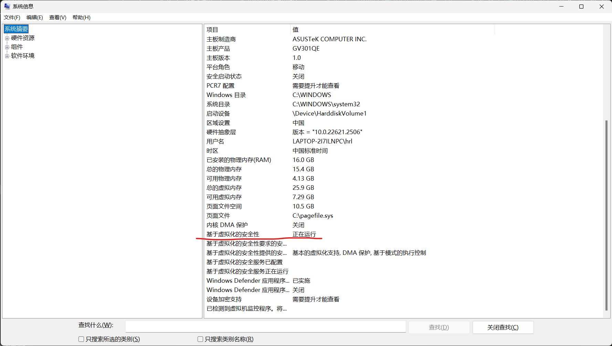
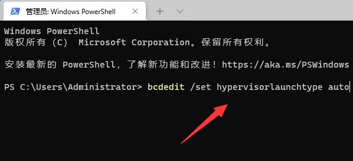

# Win11 vbs功能的关闭与开启

## 检查vbs是否开启

win + r 输入 msinfo32 回车



基于虚拟化的安全性：
正在运行就是启用了，否则关闭了

## vbs关闭

https://blog.csdn.net/Ning2019/article/details/144770404

## vbs启动

管理员运行 power shell



输入：

```bash
bcdedit /set hypervisorlanuchtype auto
```

运行完重启电脑
