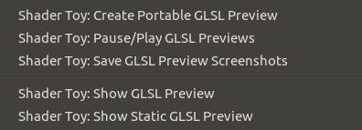
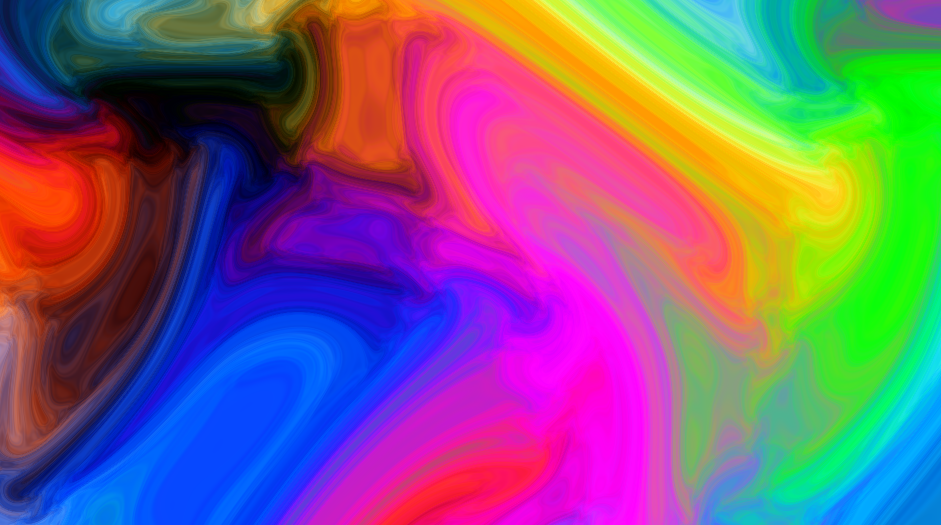

# GLSL的vscode开发插件

## shader toy

这个glsl插件可以比较方便的编写glsl代码，有语法高亮、错误提示、实时渲染等功能。

不过用的时候要注意，一个文件里只能有一个main函数，导入其它文件，其它文件里也不能有main函数。
和OpenGL里用还是有点区别的。

运行渲染直接鼠标右击文件空白处选择`Show GLSL Preview`即可。



## 示例

```glsl
// License Creative Commons Attribution-NonCommercial-ShareAlike 3.0 Unported License.
// Created by S.Guillitte
void main() {
    float time = iGlobalTime * 1.0;
    vec2 uv = (gl_FragCoord.xy / iResolution.xx - 0.5) * 8.0;
    vec2 uv0 = uv;
    float i0 = 1.0;
    float i1 = 1.0;
    float i2 = 1.0;
    float i4 = 0.0;
    for (int s = 0; s < 7; s++) {
        vec2 r;
        r = vec2(cos(uv.y * i0 - i4 + time / i1), sin(uv.x * i0 - i4 + time / i1)) / i2;
        r += vec2(-r.y, r.x) * 0.3;
        uv.xy += r;
 
        i0 *= 1.93;
        i1 *= 1.15;
        i2 *= 1.7;
        i4 += 0.05 + 0.1 * time * i1;
    }
    float r = sin(uv.x - time) * 0.5 + 0.5;
    float b = sin(uv.y + time) * 0.5 + 0.5;
    float g = sin((uv.x + uv.y + sin(time * 0.5)) * 0.5) * 0.5 + 0.5;
    gl_FragColor = vec4(r, g, b, 1.0);
}
```


