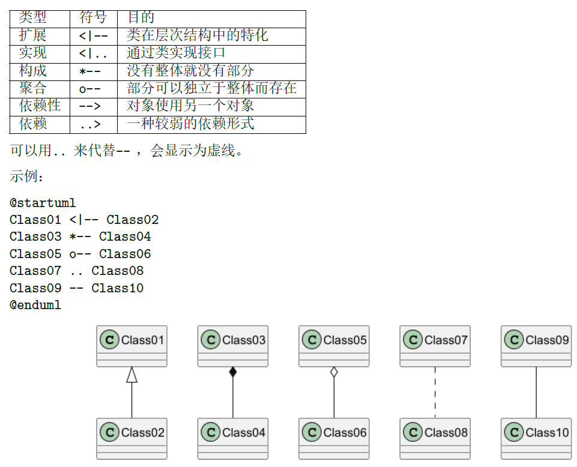
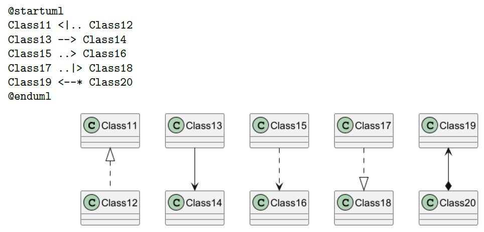
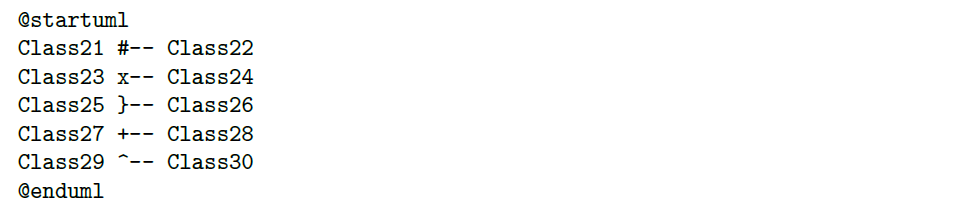
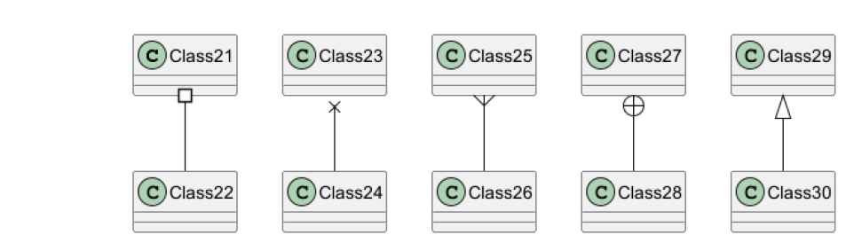
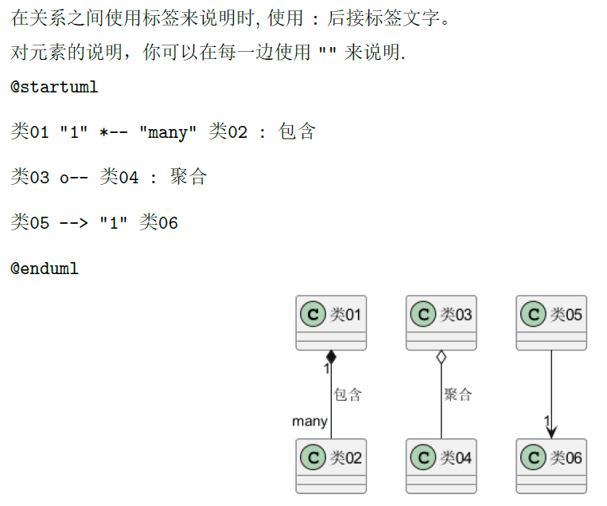
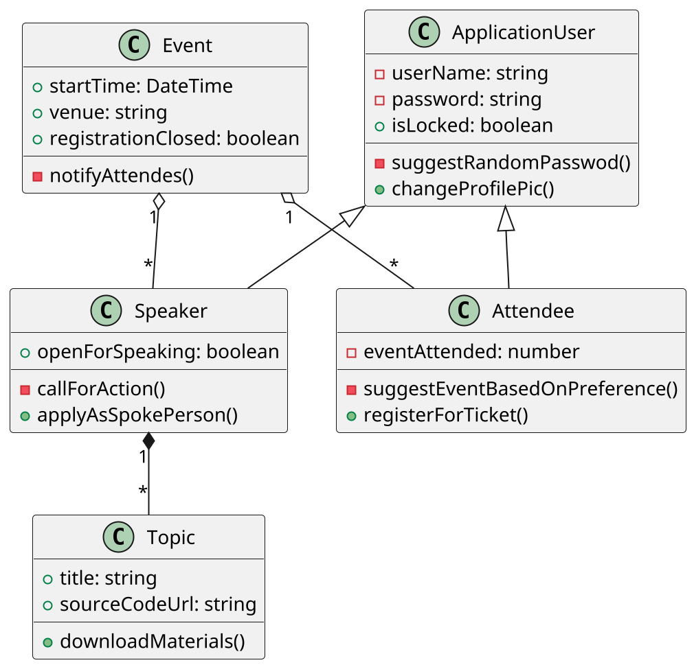
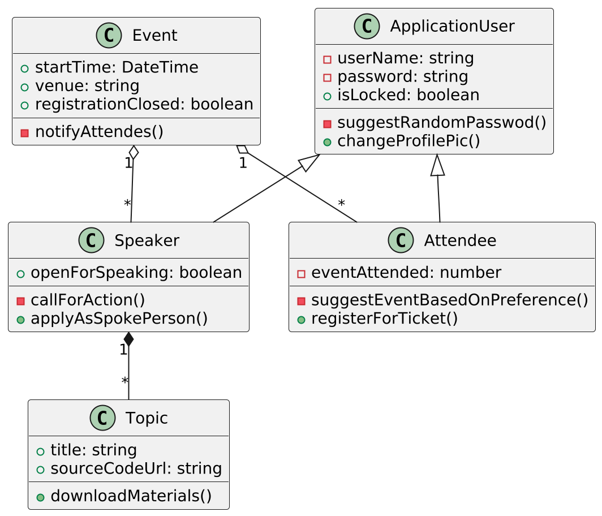

# PlantUML

一个通过编码画 UML 的插件

```
+: 可见，public
—: 不可见，private
#: 继承 protected

<|-- 接口实现

```












通过 [在线Server](https://www.plantuml.com/plantuml/uml/SyfFKj2rKt3CoKnELR1Io4ZDoSa70000) 即可生成：


