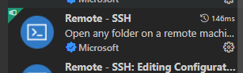
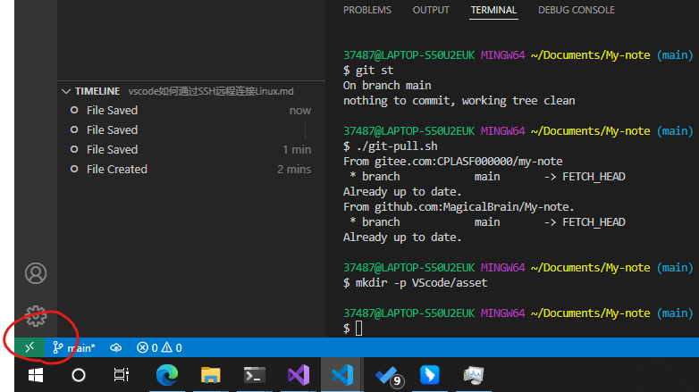
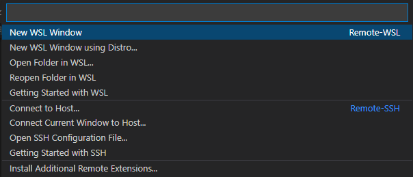
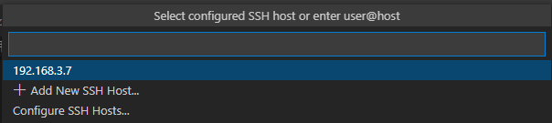

# vscode如何通过SSH远程连接Linux

## 安装插件

首先就是安装插件：



## 使用插件

安装完插件之后点击：



点击vscod左下角的绿色连接按钮（上图中红圈里的）

然后在弹出的窗口里



选择`Connect to Host`

先选择远程访问设备的系统：

选择`Linux`

然后输入ssh的host：



```bash
nx@192.168.6.6
```

最后输入密码后按下回车即可。
