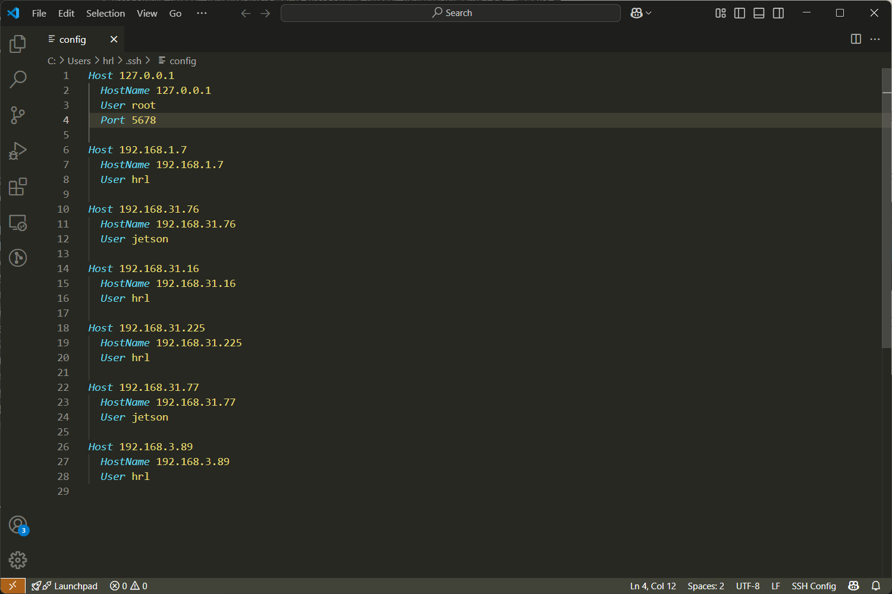

# vscode如何通过SSH远程连接Linux

## 安装插件

首先就是安装插件：


## 使用插件

安装完插件之后点击：


点击vscod左下角的绿色连接按钮（上图中红圈里的）

然后在弹出的窗口里


选择`Connect to Host`

先选择远程访问设备的系统：

选择`Linux`

然后输入ssh的host：


```bash
nx@192.168.6.6
```

最后输入密码后按下回车即可。

## 设置端口 Port

有些场景下需要设置端口，例如本机运行了一个docker容器我想ssh登录
由于是本机运行所以host和本机一样：

* 本机登录就用 username@127.0.0.1
* 同一网段登录就用 username@hostip (即本机的ip地址)


点击 Configure SSH Hosts
然后选择任意ssh配置文件（一般选择第一个），然后就会打开文件：



上图是我本机的，然后我直接在文件第一行添加如下内容：

```bash
Host 127.0.0.1
  HostName 127.0.0.1
  User root
  Port 5678
```

ip、user、port参照docker的配置，然后就可以了：


