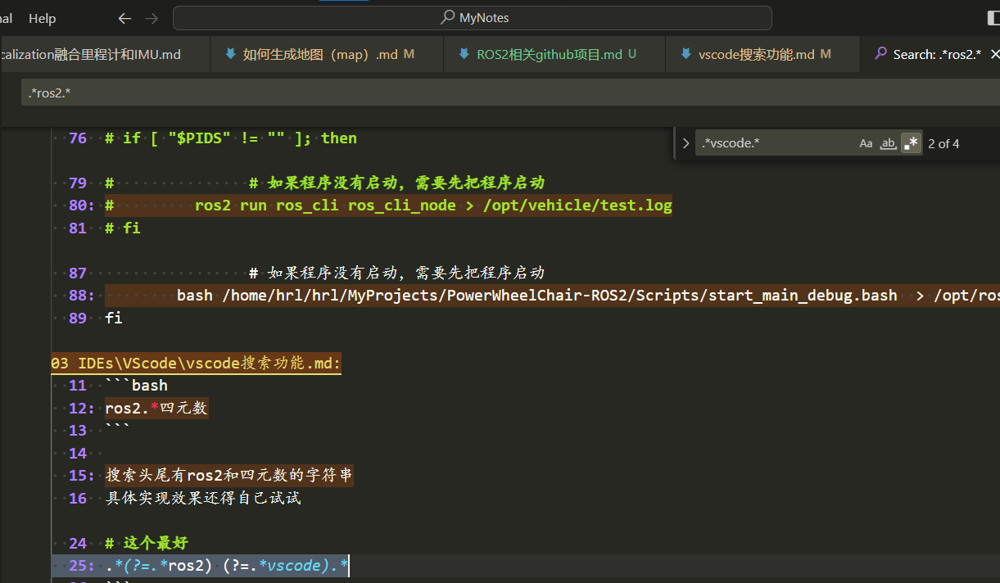
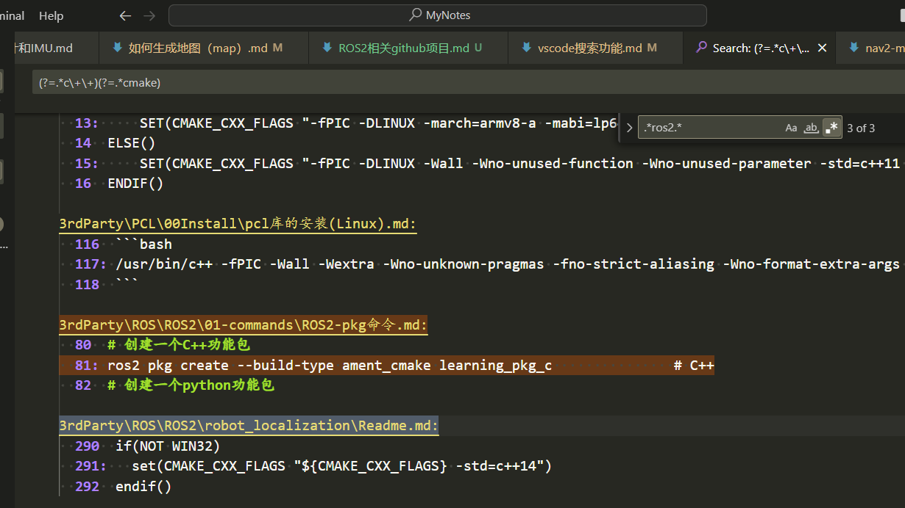

<!--
 * @Author: MB's X13 374870361@qq.com
 * @Date: 2023-06-27 00:33:28
 * @LastEditors: MB's X13 374870361@qq.com
 * @LastEditTime: 2023-10-16 16:59:47
 * @FilePath: \Notes\MyNotes\03 IDEs\VScode\vscode搜索功能.md
 * @Description: 
-->
# vscode搜索功能

快捷键是ctrl F

alt+回车 打开搜索全页面

## 如何搜索多个关键字

这个只能使用正则表达式来实现了

```bash
ros2.*四元数
```

搜索头尾有ros2和四元数的字符串
具体实现效果还得自己试试

### 同行多个关键字搜索

```bash
.*keyword1.*keyword2.*
.*keyword2.*keyword1.*

# 这个最好
.*(?=.*ros2) (?=.*vscode).*
```

顺序如果正方两个顺序都能处理该如何？
将上面两个正则表达式取 或

### 如果2个关键字不在同一行，但要求同时出现

先ctrl + f 输入：

`.*ros2.*`

ros2 是其中一个关键字

然后在结果页面中再ctrl+F，输入`.*vscode.*`来进行搜索，如图：



推荐使用正则表达式如下：

```bash
(ros.*)(.*vscode)
# 或
(.*ros.*)(.*vscode.*)
```

### 如果多个关键字不在同一行

步骤和上面的类似：

先ctrl + f 输入：

`(?=.*c\+\+)(?=.*cmake)`

c++ 和 cmake 是其中两个关键字

然后在结果页面中再ctrl+F，输入`.*ros2.*`来进行搜索，ros2是最后一个关键字

结果如图：



反正有n个关键字，就先匹配n-1个关键字，然后再搜索结果页面再接着搜索最后一个关键字

## ai的做法

## 相关正则表达式的参考链接

https://blog.csdn.net/weixin_43934110/article/details/109103942
https://www.jianshu.com/p/9c4979a3b7e4
