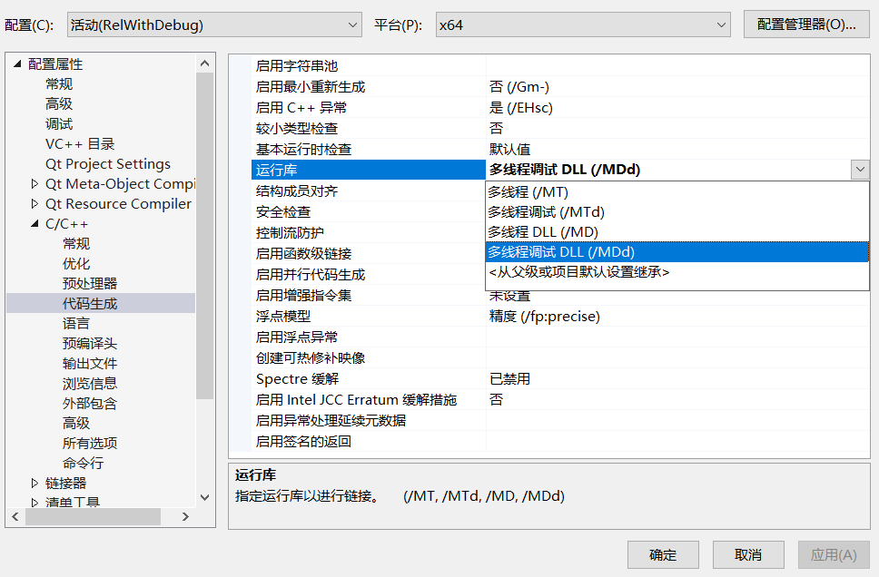

# visual studio配置debug设置时常见错误

## LNK2038	检测到“_ITERATOR_DEBUG_LEVEL”的不匹配项: 值“2”不匹配值“0”(DarkStyle.obj 中)	

这个错误其实是在编译生成dll的时候所调用的dll是release版本，而工程是debug版本的

另外在设置项目多线程的时候：

上图中的**多线程调试DLL**才能生成我们想要的带调试信息的DLL

而多线程DLL则是生成release版本的DLL

## E2422 默认化的默认构造函数不能是 constexpr，因为对应的隐式声明的默认构造函数不会是 constexpr	

编译Qt项目时出现这个错误，检查一下是不是有qt项目没有设置qt好的版本和路径
