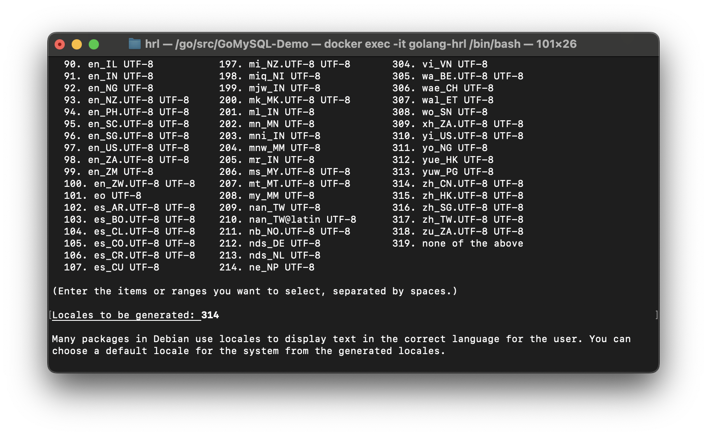

# Bash终端中文乱码

## Linux

这里以Debian为例

```bash
apt install locales -y
dpkg-reconfigure locales
```



从图中可见，zh_CN.UTF-8 UTF-8 对应的序号是 314，然后

根据提示输入314，回车，然后根据提示继续往下走


然后根据提示输入3

检查是否生效：

```bash
locale
```

可见还没有生效

```bash
vim /etc/profile
# 在末尾输入
export LANG=zh_CN.UTF-8
```

然后保存，并source一下

```bash
source /etc/profile
source ~/.bashrc
```

应该就行了


参考链接：
https://blog.csdn.net/qq_29183811/article/details/126772950
