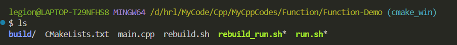

# Git-Bash无法给sh脚本赋予可执行权限

## 运行chmod命令

```bash
chmod a+x your_script.sh
```

如果不起作用，如图：



我这里想要给 rebuild.sh 赋予执行权限，结果运行chmod命令没有反应，那么应该是文件内容的问题：

```bash
#!/bin/bash
# 没有上面这一行代码，chmod是没有用的

rm -r build
mkdir build && cd build
cmake -A x64 ..
cmake --build .

```
