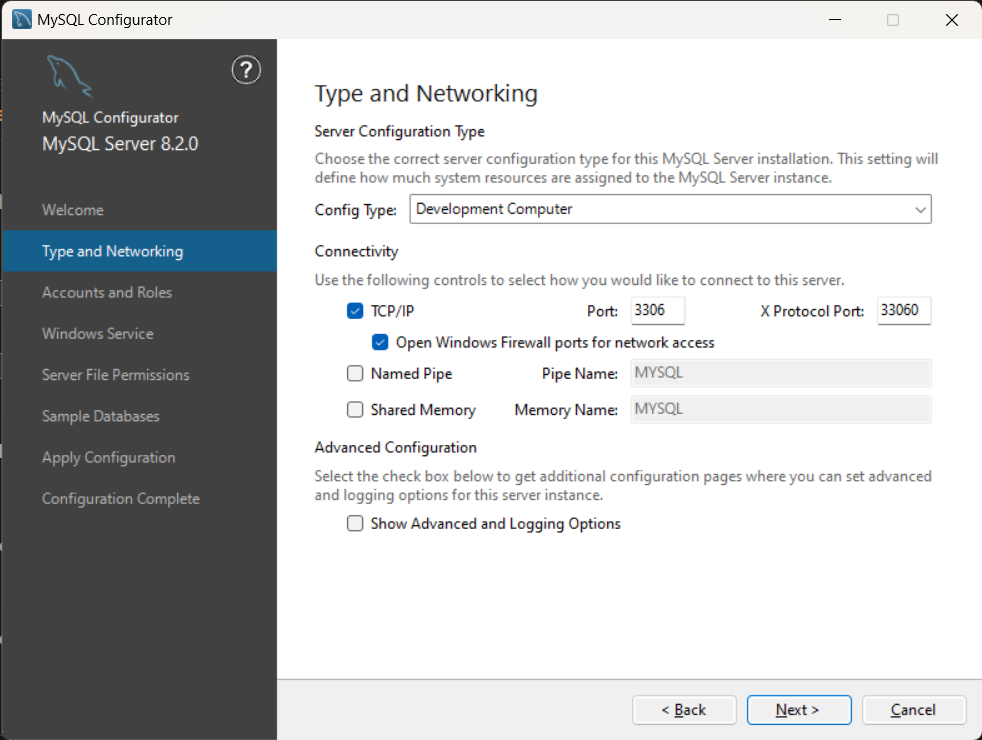

# MySQL的安装和配置

## docker

```bash
docker pull mysql:8.0-debian
# 不推荐直接下最新的，有可能下载下来的是 orcale based linux 不方便使用
# docker pull mysql
```

这里推荐下载 debian 版的mysql镜像

然后运行：

```bash
docker run -itd --name mysql-test -p 3306:3306 -e MYSQL_ROOT_PASSWORD=123456 mysql
```

-itd (三个参数的组合)
-i (interactive): 保持标准输入打开，即使没有连接到容器
-t (tty): 分配一个伪终端
-d (detached): 在后台运行容器（守护进程模式）

-e MYSQL_ROOT_PASSWORD=123456
环境变量设置
-e 表示设置环境变量
MYSQL_ROOT_PASSWORD=123456 设置MySQL root用户的密码为123456
这是MySQL官方镜像要求的环境变量

`-p 3306:3306` ：映射容器服务的 3306 端口到宿主机的 3306 端口，外部主机可以直接通过 宿主机ip:3306 访问到 MySQL 的服务。
`MYSQL_ROOT_PASSWORD=123456`：设置 MySQL 服务 root 用户的密码

----

https://www.runoob.com/docker/docker-install-mysql.html
https://blog.csdn.net/qq_25482375/article/details/126250746

## windows

### 下载

下载地址：
https://dev.mysql.com/downloads/mysql/

### 配置



## linux

这里以Ubuntu20 server 为例 通过apt安装MySQL

```bash
#命令1
sudo apt-get update
#命令2
sudo apt-get install mysql-server
```

配置 mysql 初始化信息

```bash
sudo mysql_secure_installation
```

https://www.cnblogs.com/JosephWong/p/13601164.html#:~:text=Ubuntu%20Server%2020.04%20%E5%AE%89%E8%A3%85MySQL%201%201.%20%E9%80%9A%E8%BF%87apt%E5%AE%89%E8%A3%85MySQL%201,%23%20%E6%9F%A5%E7%9C%8B%E9%98%B2%E7%81%AB%E5%A2%99%E7%8A%B6%E6%80%81%202%20sudo%20%20ufw%20status%20

### root 密码

注意按照以上安装步骤安装的，
默认root是没有密码的？

```bash
sudo mysql # 即可连接mysql了
# 然后就应该修改密码
```

## 参考链接

https://blog.csdn.net/m0_52559040/article/details/121843945
