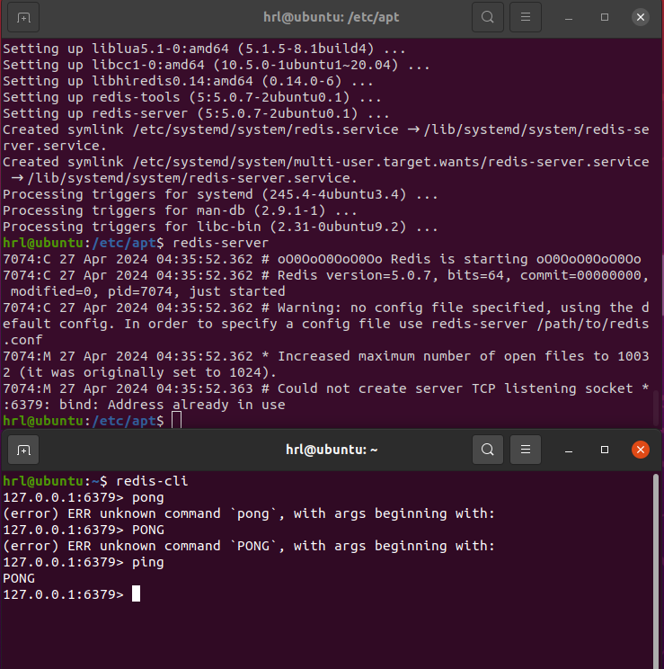

# 01 redis的安装

## Ubuntu

### apt安装

```bash
sudo apt update
sudo apt install redis-server
```

### 源码安装

## 验证安装

### 1 启动 Redis

```bash
redis-server
```

### 2 查看 redis 是否启动？

```bash
redis-cli
```

以上命令将打开以下终端：

```bash
redis 127.0.0.1:6379>
```

127.0.0.1 是本机 IP ，6379 是 redis 服务端口。现在我们输入 PING 命令。

```bash
redis 127.0.0.1:6379> ping
PONG
```



## Windows


