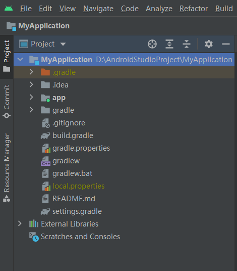

# 1.3.4 Android Studio工程文件目录分析

打开一个工程，点击Project界面就会看到真实的目录：

## `.gradle` 和 `.idea`

存放的都是Android Studio自动生成的东西，我们无需关心。

**不要去手动编辑！**

## app

项目中的代码、资源文件等内容几乎都是放置在这个目录下的。

我们的开发工作基本是围绕这个文件夹进行的。

## build

这里主要包含了一些在编译时自动生成的文件

## gradle

这个目录下包含了

## .gitignore

这个会git的都知道，在此不提

## build.gradle

## gradle.properties

## gradlew和gradlew.bat

## *.iml

这个文件只是所有IntelliJ IDEA项目都会自动生成的一个文件。
而Android Studio是基于IntelliJ IDEA开发的，所以会有这个文件。

但是新版的Android Studio没有这个，我们不需要关心这个文件

## local.properties

这个文件通常用于指定本机中的Android SDK路径，通常内容都是自动生成的。

但是有的时候需要手动修改（例如配置第三方环境、函数库的时候）。

## settings.gradle

这个文件用于指定项目中所有引入的模块。

由于HelloWorld中只有一个app模块，所以就只引用了app模块。
