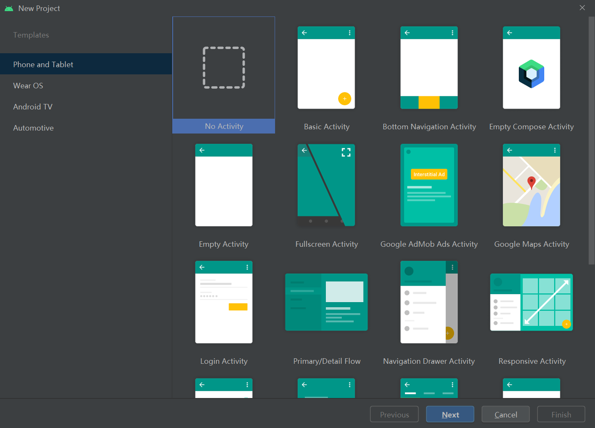

# Android Studio使用C++开发App

Android Studio如果需要使用C++来进行开发的话，则需要配置NDK和CMake。

Android Studio的安装在此就不再赘述了（实在不行可以参考这个：https://zhuanlan.zhihu.com/p/80051318）。

## 配置NDK

简单，随便新建一个空的项目，如图：

进去编辑界面后，点击`Tools -> SDK Manager`如图：

把NDK和CMake勾上就行：

## 配置CMake

如果没有特殊的要求，其实上一步就把CMake也装好了，但是我电脑上有好几个版本的CMake，咋办？

有坑，待填。

## 新建一个NDK项目

一开始和Java啥的都一样，随便新建一个空项目就行。

关键是配置`CMakeLists.txt`

## 参考资料

官方文档：https://developer.android.google.cn/studio/projects/install-ndk?hl=zh-cn