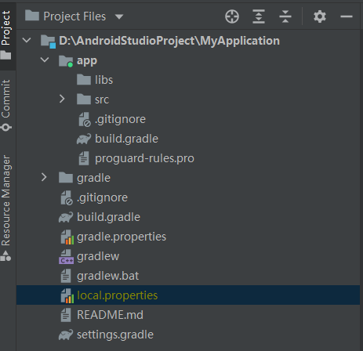

# 1.3.4 Android Studio build文件目录分析

## build

## libs

如果你使用了第三方的jar包，那么就需要你把那些jar包放到这个文件夹里，这样那些jar包就会自动被添加到构建路径里去。

## androidTest

此处时用来编写Android Test测试用例的，可以对项目进行一些自动化的测试

## java

放置所有java代码的。

## res

所有项目中用到的图片、布局、字符串等资源都在这里了。

drawable
放图片

layout
放布局

values
放字符串

## AndroidManifest.xml

这是整个Android工程的配置文件，在程序中定义的所有四大组件都需要在这里注册。

另外还可以在这里给程序添加权限声明。

## test

这个是用来写单元测试（Unit Test）的测试用例的，是对项目进行自动化测试的另一种方式

## .gitignore

## app.iml

## build.gradle

app模块的gradle构建脚本，会在这里指定很多项目构建相关的配置。

## `proguard-rules.pro`

这个文件用于指定项目代码的混淆规则，当代码开发完后打包成安装包文件，如果代码不希望被别人破解，通常会将代码进行混淆，从而让破解者难以阅读。
