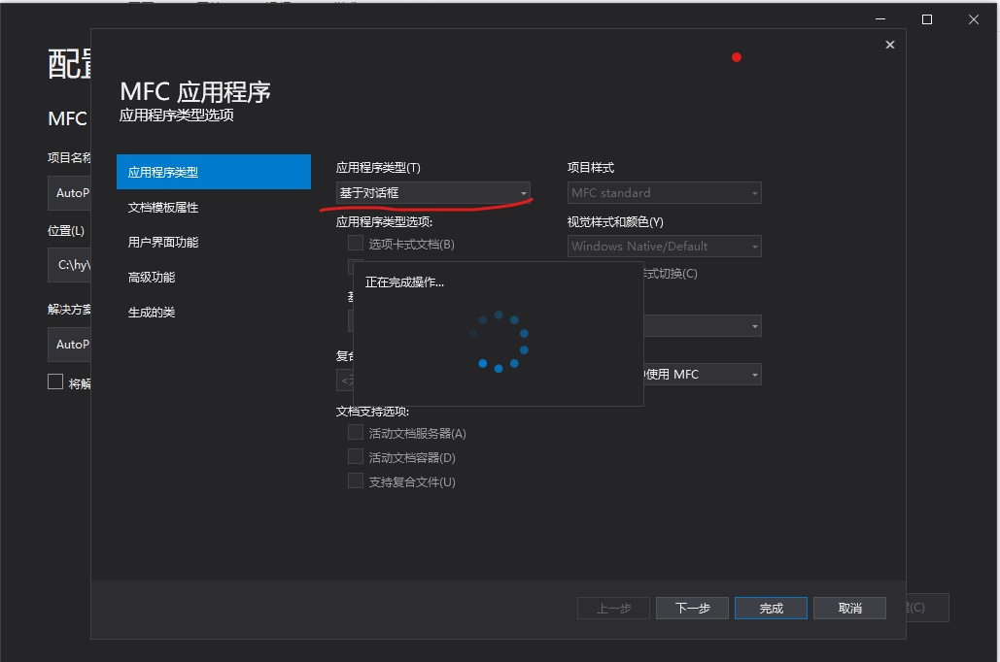
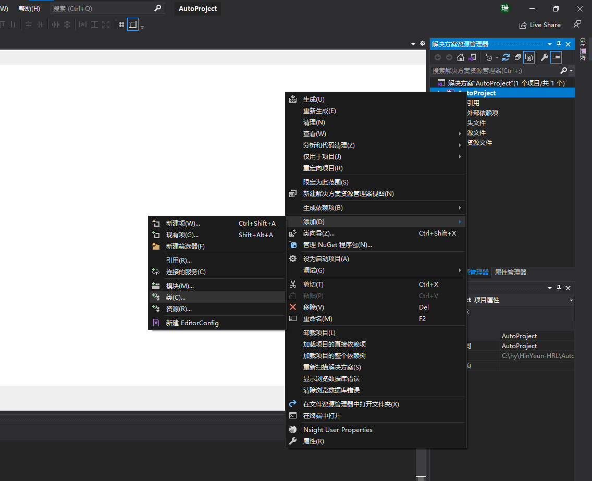

# C++如何操控word

[C++如何操控word](https://stackoverflow.com/questions/145573/creating-opening-and-printing-a-word-file-from-c)

**主要使用的技术有**：
1. MFC
2. office组件的包装类

## 思路

我们其实是要建立一个简单的自动化客户端。

主要步骤如下：
1. 创建一个自动化客户端
2. 添加Office Excel自动化控制代码
3. 运行客户端

## 创建一个自动化客户端

1、在vs里新建一个 `MFC应用程序`：

在应用程序类型里选择：基于对话框，然后点击完成即可新建项目成功

2、修改对话框：

    1. 将正中间的文本框和有下角的取消按钮删除
    2. 修改确定按钮的ID为IDRun，并修改其文字为 Run

3、创建包装类：

