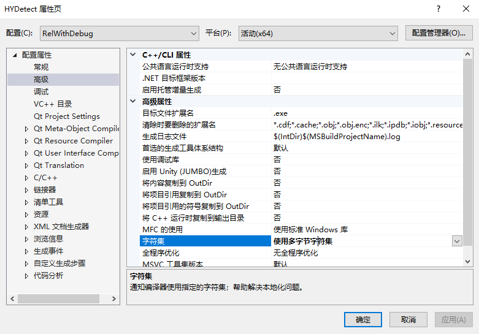

# C++如何获取日期

## time.h

使用跨平台的通用代码：
使用`currentDateTime()`函数，代码如下：

@import "./code/getDate.cpp"

## ctime.h

```cpp
//日期
CTime time = CTime::GetCurrentTime();
string date;

CString curdate = time.Format("%Y-%m-%d");
date = (CStringA)curdate;
QVariant Qdate(QString::QString::fromStdString(date));
HY_LOG_I("Date Data add finish");
```        

如果报错，一下办法可能可以解决：



将上面的字符集设为==多字节字符集==即可
