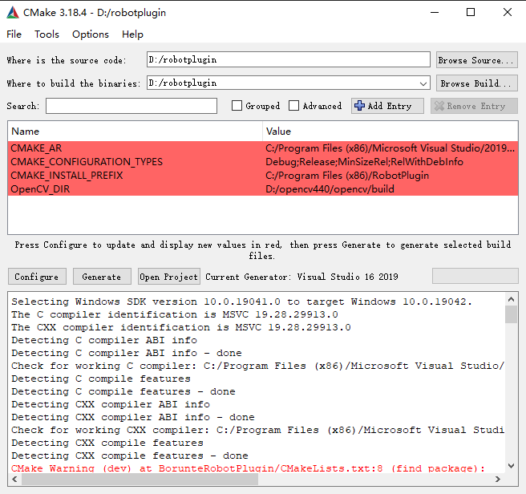
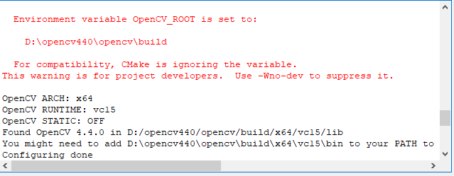
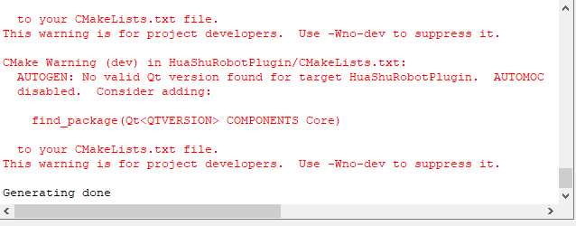

# 如何使用Cmake生成Visual Studio解决方案

注意：得使用cmake-gui来设置

`Where is the source code` 设置项目源代码路径

`Where to build the binaries` 设置项目vs解决方案输出路径

点击configure，没有错误就ok

再点击Generate，没有错误就ok

然后在输出目录下就能看到生成好的解决方案，且可使用visual studio来打开了。

注意：
其实vs可以直接打开cmake工程而无需生成vs解决方案
