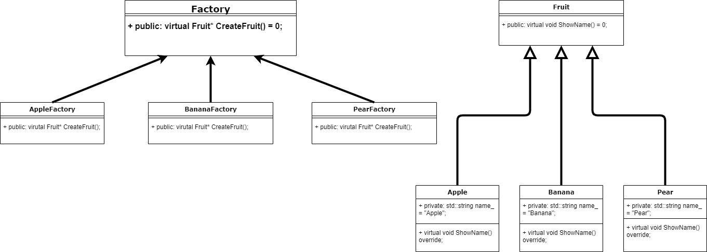

# 工厂方法模式(Factory Method Pattern)

工厂方法模式又称工厂模式、多态工厂模式和虚拟构造器模式，通过定义工厂父类负责定义创建对象的公共接口，而子类则负责生成具体的对象。

## 基本介绍

假设现在的场景是 `简单工厂模式.md` 里的水果工厂

我们现在不仅对对水果进行抽象，还对工厂进行抽象，使得一个具体工厂生产一个具体水果。

但我们新增水果的时候，除了新的水果类，我们还需要新的具体工厂类。

这样一来我们发现，每当新增一种水果，类的个数就会成倍增加，导致类越来越多，增加维护成本。
但是好处就是符合开闭原则

## 实例代码

```cpp
// 工厂方法模式
// Factory Method Pattern
// 
// 这里用一个水果公司的例子来说明
//

#pragma once

#include <iostream>
// 水果抽象类及其具体类的定义都在这个头文件里，但是我们笔记里还是要写出来
//#include "SimpleFactoryPattern.hpp"

/// @brief 水果抽象类 虚基类
class Fruit
{
public:
	Fruit() = default;;
	virtual ~Fruit() {}

	virtual void showName() = 0;

private:

};

/// @brief 苹果类
class Apple : public Fruit
{
public:
	Apple() = default;;
	virtual ~Apple() {}

	virtual void showName() {
		std::cout << "苹果\n";
	}

private:

};

/// @brief 香蕉类
class Banana : public Fruit
{
public:
	Banana() = default;;
	virtual ~Banana() {}

	virtual void showName() {
		std::cout << "香蕉\n";
	}

private:

};

/// @brief 鸭梨类
class Pear : public Fruit
{
public:
	Pear() = default;;
	virtual ~Pear() {}

	virtual void showName() {
		std::cout << "鸭梨\n";
	}

private:

};

/// @brief 水果工厂类 abstract
class AbstractFruitFactory
{
public:
	AbstractFruitFactory() = default;
	~AbstractFruitFactory() = default;

	virtual Fruit* CreatFruit() = 0;

private:

};

/// @brief 苹果工厂
class AppleFactory : public AbstractFruitFactory
{
public:
	AppleFactory() = default;
	~AppleFactory() = default;

	virtual Fruit* CreatFruit() {
		return new Apple;
	}

private:

};

/// @brief 香蕉工厂
class BananaFactory : public AbstractFruitFactory
{
public:
	BananaFactory() = default;
	~BananaFactory() = default;

	virtual Fruit* CreatFruit() {
		return new Banana;
	}

private:

};

/// @brief 鸭梨工厂
class PearFactory : public AbstractFruitFactory
{
public:
	PearFactory() = default;
	~PearFactory() = default;

	virtual Fruit* CreatFruit() {
		return new Pear;
	}

private:

};

void testFactoryMethodPattern() {
	AbstractFruitFactory* factory = nullptr;
	Fruit* fruit = nullptr;

	// 吃苹果
	factory = new AppleFactory;
	fruit = factory->CreatFruit();
	fruit->showName();

	// 吃香蕉
	factory = new BananaFactory;
	fruit = factory->CreatFruit();
	fruit->showName();

	// 吃鸭梨
	factory = new PearFactory;
	fruit = factory->CreatFruit();
	fruit->showName();

	delete factory;
	delete fruit;
}

```

## UML 类图



## 总结

工厂方法模式 = 简单工厂模式 + 开闭原则

优点：
1. 不需要去记类名，甚至参数名也不需要记忆
2. 实现了对象创建和使用的分离
3. 系统的可扩展性也就变得非常好，无需修改接口和原先的类

缺点：
1. 增加系统中的类的个数，复杂度、抽象性和理解难度都增加了
2. 

## 使用场景

1. 客户端不需要知道对象的类
2. 通过抽象工厂，用抽象工厂类的子类来创建对象

