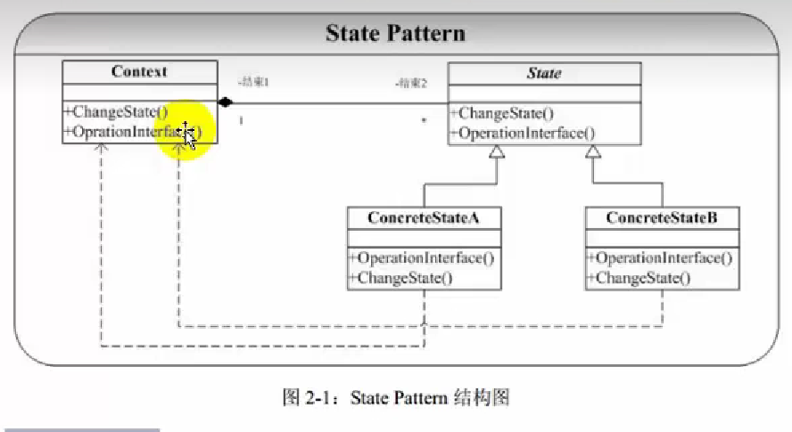

# 状态模式(State)

## 基本介绍

## 类图



## 实例代码

```cpp
// 状态模式 (StatePattern)
// 
// 这里用一个行人的例子来说明
//

#pragma once

#include <iostream>

using namespace std;

class Worker;

class State
{
public:
	State() = default;
	~State() = default;

	virtual void DoSomething(Worker* w) = 0;

private:

};

class Worker
{
public:
	Worker() = default;
	~Worker() = default;

	int getHour() {
		return hour_;
	}

	void setHour(int h) {
		hour_ = h;
	}

	State* getCurrentState() {
		return current_state_;
	}

	void setCurrentState(State* s) {
		current_state_ = s;
	}

	void Do() {
		current_state_->DoSomething(this);
	}

private:
	int hour_;
	State* current_state_;
};


/* ----- 具体状态类实现 ----- */
 
class State_01 : public State
{
public:
	State_01() = default;
	~State_01() = default;

	virtual void DoSomething(Worker* w) override;

private:

};

class State_02 : public State
{
public:
	State_02() = default;
	~State_02() = default;

	virtual void DoSomething(Worker* w) override;

private:

};

void State_01::DoSomething(Worker* w) {
	// 检查是否满足状态1
	if (w->getHour() >= 7 && w->getHour() <= 9) {
		cout << "state 01: eating breakfast" << endl;
	}
	// 否则转到状态2
	else
	{
		delete w->getCurrentState();
		w->setCurrentState(new State_02);
		w->getCurrentState()->DoSomething(w);
	}
}

void State_02::DoSomething(Worker* w) {
	// 检查是否满足状态2
	if (w->getHour() >= 12 && w->getHour() <= 14) {
		cout << "state 01: eating lunch" << endl;
	}
	// 否则 状态未定义 
	else
	{
		delete w->getCurrentState();
		cout << "状态未定义！" << endl;
	}
}

void testStatePattern() {
	Worker* w1 = new Worker;
	
	int hour = 0;
	cout << "请输入hour来判断工人的状态！" << endl;
	cin >> hour;
	cin.get();

	w1->setHour(hour);
	w1->setCurrentState(new State_01);
	w1->Do();
}
```
