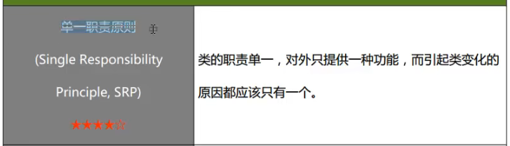
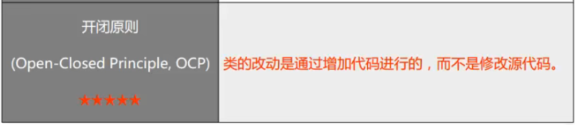
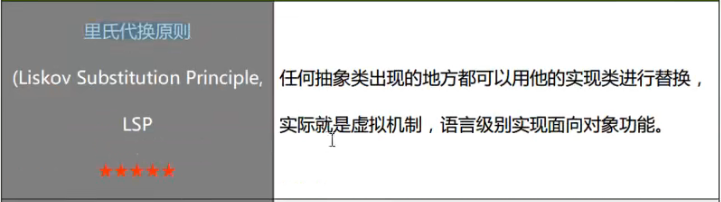
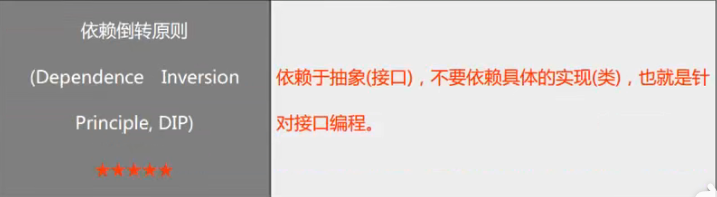
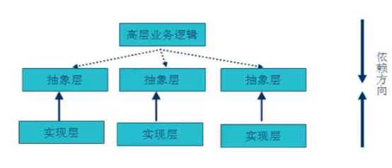
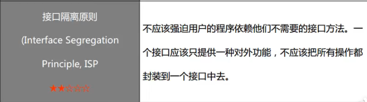
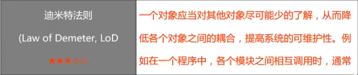
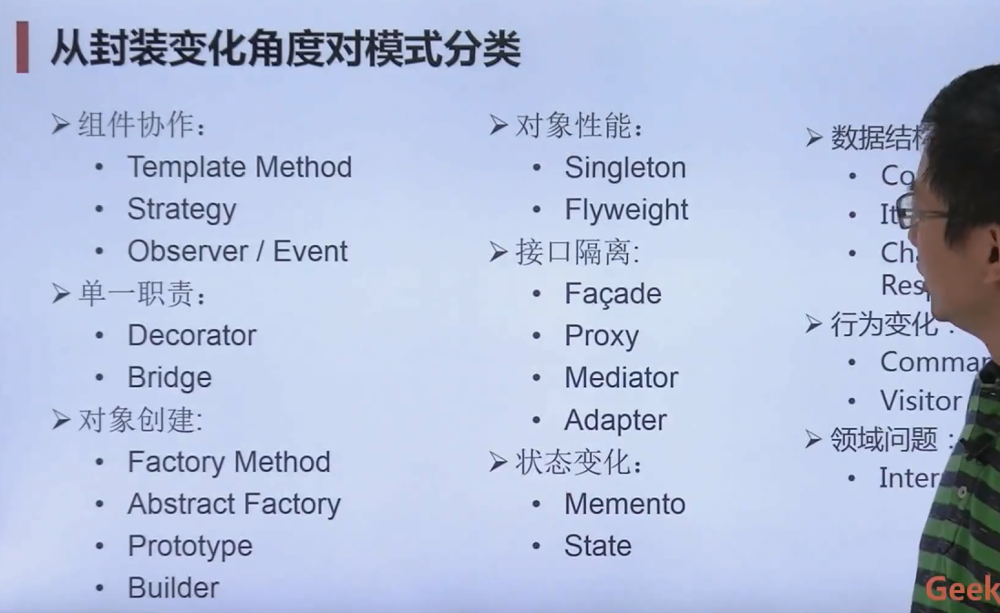

# 设计模式(design-pattern)

这是关于设计模式的学习笔记。

设计模式很重要，想要软件写得好，从初级程序员进阶到高级工程师，这是必不可少的能力。

理论笔记即部分代码这里有，但是完整的代码实现是在：
https://gitee.com/CPLASF000000/design-pattern-learning

## 设计模式的分类

1. 创建型模式
2. 结构型模式
3. 行为型模式

上述三类共有23种，另有一种事简单工厂模式，即共有24种

* 创建型模式
  * 1、抽象工厂模式 (Abstract Factory Pattern)
  * 2、工厂方法模式 (Factory Method Pattern)
  * 3、生成器模式 (Builder Pattern)
  * 4、原型模式 (Prototype Pattern)
  * 5、单例模式 (Singletom Pattern)
* 结构型模式
  * 6、适配器模式 (adapter Pattern)
  * 7、桥接模式 (Bridge Pattern)
  * 8、组成模式 (Composite Pattern)
  * 9、装饰模式 (Decorator Pattern)
  * 10、外观模式 (Facade Pattern)
  * 11、享元模式 (FlyWeight Pattern)
  * 12、代理模式 (Proxy Pattern)
* 行为型模式
  * 13、职责链 (Chain of Responsibilty Pattern)
  * 14、命令 (Command Pattern)
  * 15、解释器 (Interpreter Pattern)
  * 16、迭代器 (Iterator Pattern)
  * 17、中介者 (Mediator Pattern)
  * 18、备忘录 (Memento Pattern)
  * 19、观察者 (Observer Pattern)
  * 20、状态 (State Pattern)
  * 21、策略 (Strategy Pattern)
  * 22、模板方法 (Template Method Pattern)
  * 23、访问者 (Visitor Pattern)
* 

## 设计模式的学习目的

其实就是要学会回答以下问题：
1. 如何将代码分散在几个不同的类中？
2. 为什么要有“接口”？
3. 什么是针对抽象编程？
4. 何时不应该使用继承？
5. 如何不修改源代码增加新功能？
6. 能够更好地阅读和理解现有类库和其它系统的源代码

现代软件设计的特征就是 需求的频繁变化
而设计模式的要求就是 寻找变化点，然后在变化点处应用设计模式，从而更好地面对需求的变化。

真正在用的时候不能够拘泥某一种设计模式，通常来说，单一设计模式是无法满足我们的需求的，我们需要“重构获得设计模式” refactoring to Patterns

## 学习的建议

1. 不要背类图而是要背案例
   1. 学会具体情况具体分析，根据业务的实际场景来选择合适的设计模式
2. 不要拘泥于某一种设计模式，灵活使用，设计模式说白了就是编程的思想

## 设计模式的原则

### 原则的目的

* 可维护性
  * 添加新功能不需要对原有的修改或者少修改
* 可复用性
  * 原有的用起来简单方便
* 高内聚，低耦合
  * 一个类，一个函数就做一件事，这样如果出了问题好排查原因

原则：
1. 单一职责原则
2. 开闭原则
3. 里氏代换原则
4. 依赖倒转原则
5. 接口隔离原则
6. 合成复用原则
7. 迪米特法则（最小知识原则）

### 1、单一职责原则

类的职责单一，对外只提供一种功能，而引起类变化的原因都应该只有一个。

一个类只做一件事，不然大项目里不好维护

### 2、开闭原则

Open-Closed Principle OCP

对扩展开放，对修改关闭

类的改动是通过增加代码进行的，而不是修改源代码

### 3、里氏代换原则

其实就算 Liskov替换原则（LSP）

子类必须能够替换他们的基类

### 4、依赖倒转原则

Dependence Inversion Principle, DIP

在传统的程序设计里，一般都是自顶向下，上层依赖中间层，中间层依赖底层实现。
但这样子做在后期维护扩展的时候很容易陷入“牵一发而动全身”的境地，不利于维护。

具体一点就是不管是上层逻辑还是底层实现都应该依赖中层的抽象层。

说白了就是，编程的时候的具体的类依赖抽象的类，而抽象的类应该是稳定的，很少修改的。

例如，实际业务中视觉传感器有好几种相机，那么可以定义一个抽象类`Camera`，再根据这个类去定义具体的相机类`Camera_HK`海康的相机

### 5、接口隔离原则

接口标准化！

### 6、合成复用原则

Composite Reuse Principle, CRP

优先使用不同类的对象组合，而不是类继承。

### 7、迪米特法则

Law of Demeter, LoD

具体做法大概就是弄一个中间类，只提供必要的接口，只读取必要的数据，只输出必要的结果。

## 从封装变化的角度对模式进行分类

### 组件协作

现代软件专业分工后第一个结果就是“框架与应用程序分离”

组件协作模式通过晚绑定，来实现框架和应用程序之间的松耦合。

* Template Method
* Strategy
* Observer/Event

### 单一职责

* Decorator
* Bridge

### 对象创建

* Factory Method
* Abstract Factory
* Prototypr
* Builder

### 对象性能

* Singleton
* Flyweight

### 接口隔离

* Facade
* Proxy
* Mediator
* Adapter

### 状态变化

* Memento
* State

### 数据结构

* Composite
* Iterator
* Chain of Resposibility

### 行为变化

* Command
* Visitor

### 领域问题

* Interpreter

## 重构的关键技法

* 静态（绑定） -> 动态
* 早绑定 ->晚绑定
* 继承 -> 组合
* 编译时依赖 -> 运行时依赖
* 紧耦合 -> 松耦合
