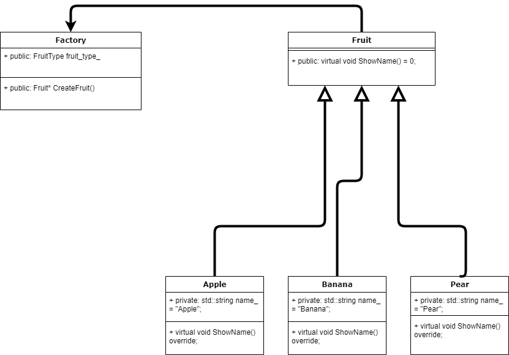

# 简单工厂模式(SimpleFactoryPattern)

## 简单介绍

这个模式下用户程序员不想创建对象只想直接拿对象来用

新建一个工厂类`class Factory`，我传参给它它就给我创建对应的类对象。

假如我传个A参数，它就给我创建A类对象
假如我传个B参数，它就给我创建B类对象

存在问题：
1. 增加新的功能（增加新的类对象创建）是通过修改源代码实现的，不符合开闭原则。
2. 工厂类职责过重，万一有问题就会影响很多地方，不符合单一职责原则

因此不属于FoV的23种设计模式。

## 实例代码

```cpp
// 简单工厂模式
// SimpleFactoryPattern
// 
// 这里用一个水果公司的例子来说明
//

#pragma once

#include <iostream>

/// @brief 水果抽象类 虚基类
class Fruit
{
public:
	Fruit() = default;;
	virtual ~Fruit() {}

	virtual void showName() = 0;

private:

};

/// @brief 苹果类
class Apple : public Fruit
{
public:
	Apple() = default;;
	virtual ~Apple() {}

	virtual void showName() {
		std::cout << "苹果\n";
	}

private:

};

/// @brief 香蕉类
class Banana : public Fruit
{
public:
	Banana() = default;;
	virtual ~Banana() {}

	virtual void showName() {
		std::cout << "香蕉\n";
	}

private:

};

/// @brief 鸭梨类
class Pear : public Fruit
{
public:
	Pear() = default;;
	virtual ~Pear() {}

	virtual void showName() {
		std::cout << "鸭梨\n";
	}

private:

};

/// @brief 水果类型枚举类
enum FruitType
{
	apple,
	banana,
	pear,
	nofruit
};

/// @brief 水果工厂类
class FruitFactory
{
public:
	FruitFactory();
	~FruitFactory();

	Fruit* CreatFruit() {
		switch (fruit_type_)
		{
		case apple:
			return new Apple;
			break;
		case banana:
			return new Banana;
			break;
		case pear:
			return new Pear;
			break;
		case nofruit:

		default:
			std::cout << "the type of fruit is null\n";
			break;
		}
	}

public:

	FruitType fruit_type_ = nofruit;
private:

};

FruitFactory::FruitFactory()
{
	
}

FruitFactory::~FruitFactory()
{
}

void testSimpleFactoryPattern() {
	FruitFactory *factory = new FruitFactory;
	
    // 创建过程无需关心，直接拿来用
	Fruit* fruit;
	factory->fruit_type_ = apple;
	fruit = factory->CreatFruit();
	fruit->showName();

	factory->fruit_type_ = banana;
	fruit = factory->CreatFruit();
	fruit->showName();

	factory->fruit_type_ = pear;
	fruit = factory->CreatFruit();
	fruit->showName();

	delete factory;
	delete fruit;
}

```

## UML 类图



## 使用场景

1. 如果工厂类需要创建的对象种类比较少，那么就可以采用简单工厂模式
2. 客户端只需要知道创建对象的参数，而不关心如何创建对象

