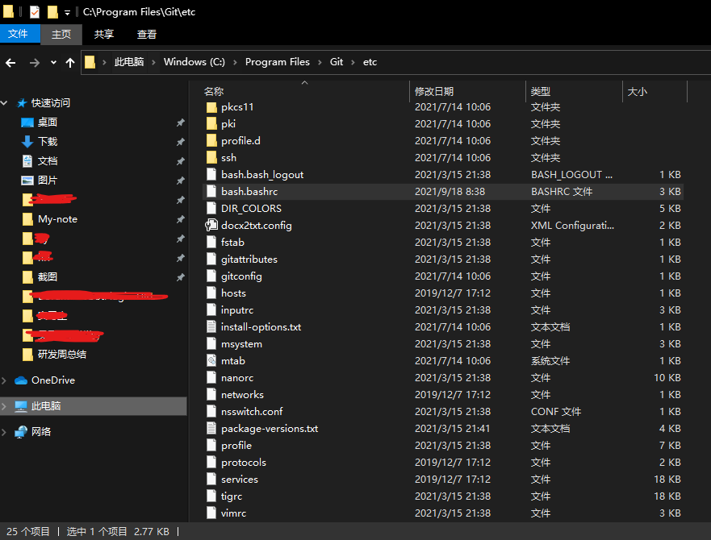
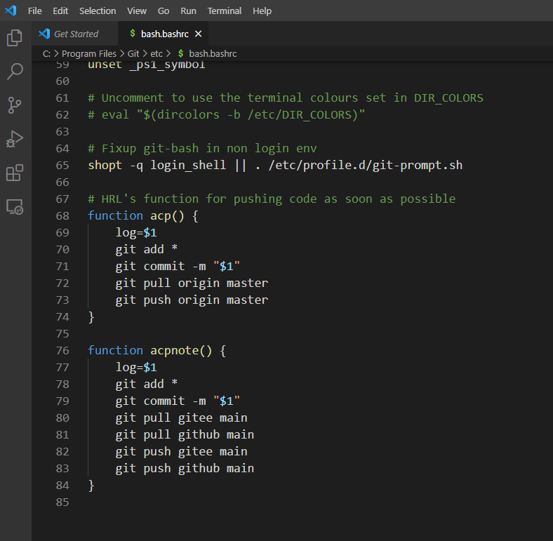
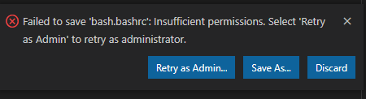

# Git如何避免忘记push

我发现vscode的git插件有一个有毒的地方：
有了修改，git commit之后修改部分的高亮就消失了，导致我如果不想commit之后立刻push的话；
过一段时间我回过头来查看就无法快速判断我是否将修改push上库了。

经常是自己的代码在公司电脑上做了修改，回到家想起来要改的时候，发现代码没上库；
那种感觉好像今天都白干了一样。

## 解决方案

找到git的安装目录（win系统需要在文件资源管理器里找），打开`/etc/bash.bashrc`文件，在最后加入一下代码，用管理员权限保存。

```bash
# HRL's function for pushing code as soon as possible
function acp() { 
    log=$1
    git add *
    git commit -m "$1"
    git pull origin master
    git push origin master
}

function acpnote() { 
    log=$1
    git add *
    git commit -m "$1"
    git pull gitee main
    git pull github main
    git push gitee main
    git push github main
}
```

**注意**：

`acp`是一般仓库用的

`acpnote`是My-note仓库用的，因为同时上传到gitee和github的main分支。

### win下设置/etc/bash.bashrc

/etc/bash.bashrc位置：



如果时默认安装在C盘的话，就是我这个位置。

用vscode打开编辑：



然后保存的时候右下角会弹出，对话框（如下）点击Retry as admin即可：



我拷贝了一份自己的`/etc/bash.bashrc`在`./code/`里，以供参考

### macOS 设置

我的macOS安装了zsh，所以设置是在`~/.zshrc`里面改的

```bash
sudo vim ~/.zshrc
```
