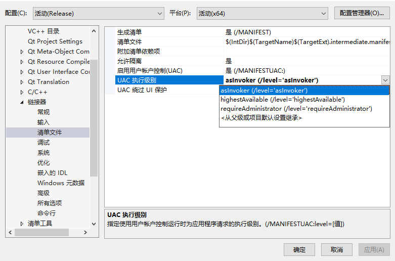

# visual studio编译运行Cpp程序的UAC设置

有的时候我们在编译运行项目进行调试的时候发现需要管理员权限。

这个时候我们可以选择不要管理员权限，取消方法如下：

打开项目的属性，找到 链接器-清单文件

将上面的UAC执行级别降低，从`highestAvailable`或者`requireAdministrator`降到`asinvoker`即可

不过这个到底有啥区别呢？接下来我们就说说个中区别

## UAC介绍和设置

用户帐户控制（User Account Control，简写作UAC)是微软公司在其Windows Vista及更高版本操作系统中采用的一种控制机制。

如果设置权限为默认位置，则启动应用程序时，会对exe权限进行检查。例如该应用程序想写文件，而该程序不是以管理员权限启动，就会因为没有权限导致无法写入成功，导致一系列问题。在win10系统中，系统对权限的管理会更加严格。

## asInvoker

level='asInvoker'：应用程序在启动该应用程序的进程相同的权限级别运行。 可以通过选择"以管理员角色运行"将应用程序提升到 更高的权限级别。

## highestAvailable

level='highestAvailable'：应用程序在它可以的最高权限级别运行。 如果启动应用程序的用户是 Administrators 组的成员，则此选项与 相同 level='requireAdministrator'。 如果最高可用权限级别高于打开过程的级别，系统将提示输入凭据。

## requireAdministrator

level='requireAdministrator'：应用程序使用管理员权限运行。 启动应用程序的用户必须是 Administrators 组的成员。 如果未使用管理权限运行打开进程，系统将提示输入凭据。

----

在测试没有问题之后打包程序再修改这个选项会比较好，打包的时候设置成`highestAvailable`就好
