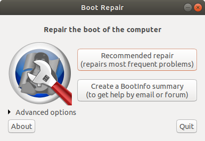
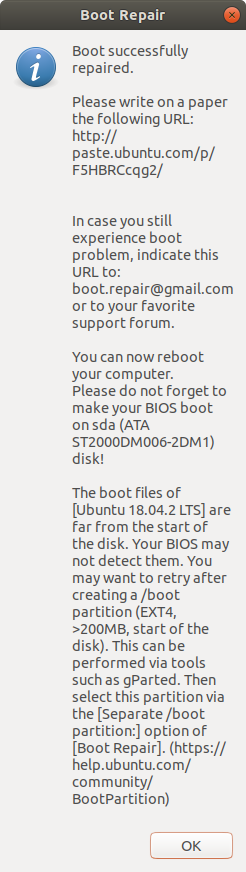

# Win10+Ubuntu双系统的安装

## win10+Ubuntu双系统

单硬盘其实和双硬盘区别不大，只是在分区的时候有一点区别。

如果怕翻车建议是买一块硬盘单独装Ubuntu，万一翻车了把硬盘抹掉就好，一点影响也没。
如果是单硬盘的话，万一翻车了，恐怕只能通过BIOS更改启动项才能正常进入原来的系统。

### win10和Ubuntu都装在同一块硬盘上

先去官网下载好要用的Ubuntu镜像（推荐16和18，不推荐20有坑）。
然后使用Rufus软件制作启动U盘。

然后先在电脑上分好区，为后面Ubuntu安装分区做准备。（很重要，也是和双硬盘不同的地方）
主要是一个装系统的大分区和一个装启动引导项的efi分区。

事先查好要安装的电脑的主板U盘启动按钮和BIOS按钮。

重启电脑，U盘启动进入Ubuntu的界面。

20的时进入试用界面的时候会问你是试用还是安装，而18的则会在进入界面之前有一个安装系统的选项。

进入系统安装后，语言->中文（简体）->键盘布局默认就好->……安装方式正常->网络不连接->其它安装->分区

### win10和Ubuntu装在不同的一块硬盘上


## 可能会遇到的问题

### 安装后直接进win10，找不到Ubuntu的启动项

[参考链接][Ubuntu18]（注意：仅适用于Ubuntu18）

1、在机器上插入Ubuntu系统的安装U盘，首先U盘引导，进入try ubuntu的选项，相当于进入了一个U盘体验系统。

2、确保主机已经联网，打开终端，分别运行下面两行命令：

```bash
sudo add-apt-repository ppa:yannubuntu/boot-repair && sudo apt-get update
sudo apt-get install -y boot-repair && boot-repair
```

3、运行后会启动Boot Repair软件，点击上面的recommended repair按钮。



根据提示进行修复即可，修复完成后会弹出如下对话框，注意这还没有完成，还需要后续操作



重启机器，在终端中分别运行下面两行命令：

```bash
sudo update-grub
sudo update-grub2
```

重启机器，可以看到开机时会出现双系统引导菜单，如下图所示：

[Ubuntu18]:https://blog.csdn.net/discoverer100/article/details/94148635
