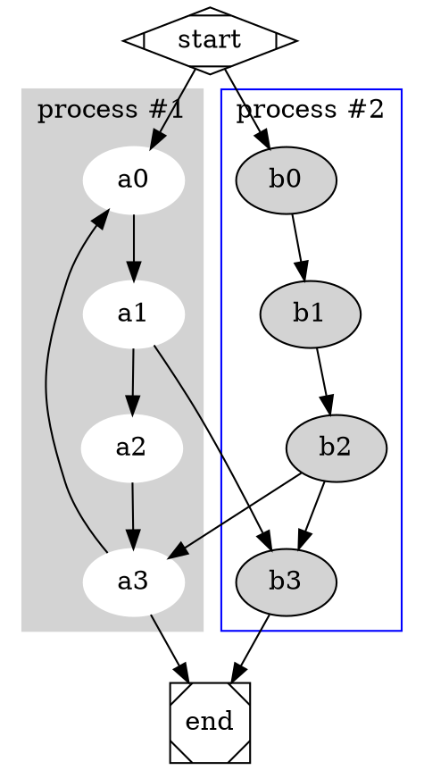
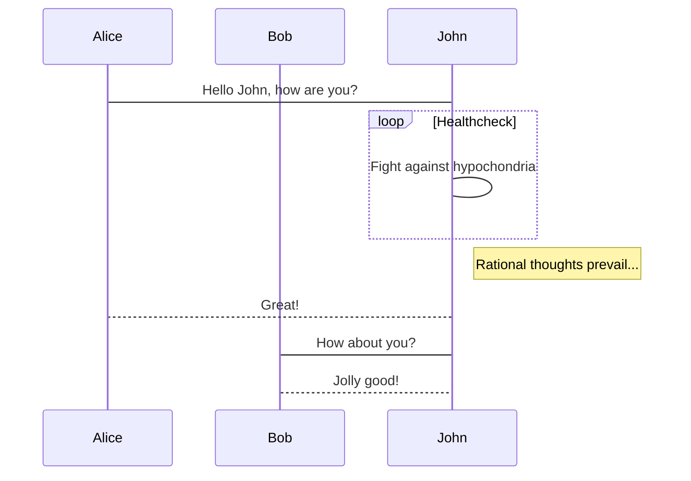
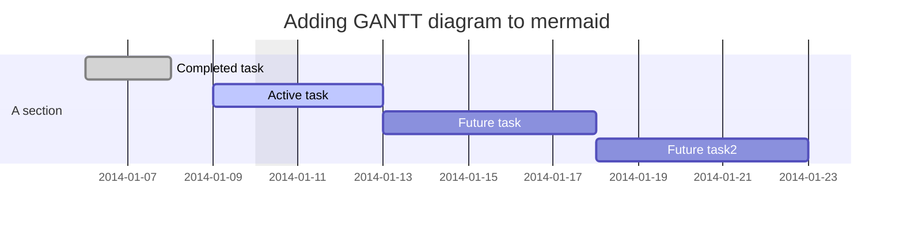
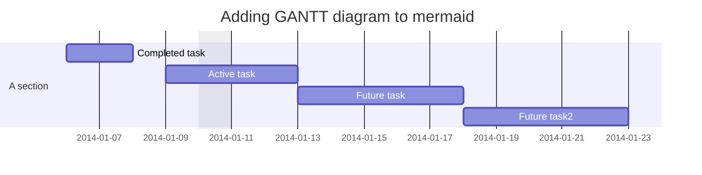
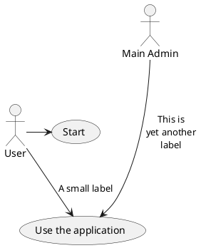

```sequence
     Andrew->China: Says Hello
    Note right of China: China thinks about it
    China-->Andrew: How are you?
    Andrew->>China: I am good thanks!
```

作者：Simple_Dev
链接：https://www.jianshu.com/p/72dd4880ec41

```flow
    st=>start: 开始
    e=>end: 结束
    op=>operation: 我的操作
    cond=>condition: 确认？

    st->op->cond
    cond(yes)->e
    cond(no)->op
```

作者：Simple_Dev
链接：https://www.jianshu.com/p/72dd4880ec41
來源：简书
简书著作权归作者所有，任何形式的转载都请联系作者获得授权并注明出处。

## Graphviz

在尝试时可以把 dot 换成 circo, fdp, neato, osage, twopi 这几种来尝试效果



## mermaid



### 甘特图

```mermaid
gantt
    title A Gantt Diagram
    dateFormat  DD
    
    section Section
    P1           :a1, 01, 30d
    P2     :after a1  , 20d
```







```echarts
option = {
    xAxis: {
        type: 'category',
        data: ['Mon', 'Tue', 'Wed', 'Thu', 'Fri', 'Sat', 'Sun']
    },
    yAxis: {
        type: 'value'
    },
    series: [{
        data: [820, 932, 901, 934, 1290, 1330, 1320],
        type: 'line'
    }]
};
```


## 关系图
