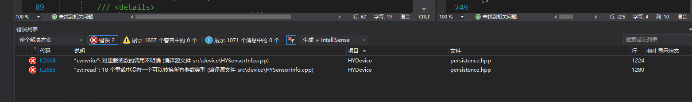

# OpenCV编译错误记录

## cv::write

### 问题描述

如下图：



`cv::write`没有对应的重载函数。

### 问题排查

经过排查是以下代码出了问题

```cpp
int save(const std::string& file)
{
	int status = HY_FAIL_IO_CLOSED;
	try
	{
		cv::FileStorage fs(file, cv::FileStorage::WRITE);
		if (fs.isOpened())
		{
			fs << "Name" << Name;
			fs << "Model" << Model;
			fs << "Version" << Version;
			fs << "Manufacturer" << Manufacturer;
			fs << "ActiveDate" << ActiveDate;
			
			fs << "SerialNo" << SerialNo;
			
			fs << "Trigger" << "[";
			for (int i = 0; i < Trigger.size(); ++i)
			{
				fs << "{";
				fs << "Source" << Trigger[i].Source;
				fs << "Activation" << Trigger[i].Activation;
				fs << "}";
			}
			fs << "]";
			
			fs << "SupportColor" << SupportColor;
			
			fs << "DecodeType" << DecodeType;
			fs << "PlainType" << PlainType;
			fs << "DisplayColor" << DisplayColor;
			fs << "DisplayBit" << DisplayBit;

			fs << "MinExposure" << (int)MinExposure;
			fs << "MinPeriod" << (int)MinPeriod;
			fs << "Exposure" << (int)Exposure;
			fs << "Period" << (int)Period;
			fs << "LiveExposure" << (int)LiveExposure;
			
			fs << "Red" << (int)Red;
			fs << "Green" << (int)Green;
			fs << "Blue" << (int)Blue;
			
			fs << "X" << X;
			fs << "Y" << Y;
			fs << "Width" << Width;
			fs << "Height" << Height;
			
			fs << "Min" << Min;
			fs << "Max" << Max;
			
			fs << "Gpu" << Gpu;
			
            fs << "Host" << host;
            fs << "Port" << port;

			status = HY_SUCESS;
		}
		fs.release();
	}
	catch (const std::exception& ex)
	{
		//HY_LOG_E("save file {} catch excepiton: {}", file, ex.what());
		std::cout << std::format("save file {} catch excepiton: {}", file, ex.what());
		status = HY_FAIL_EXCEPTION;
	}

	return status;
}
```

但是这里好像没有`cv::write`这个东西，对不对？

其实它是在`fs <<`这里调用的

经过一个多小时的排查原来是这句代码出问题：

```cpp
fs << "Port" << port;
```

问题出在哪？为什么说没有与之对应的重载函数？

查了下`port`的定义：

```cpp
unsigned int port;
```

原来`cv::write`没有对`unsigned`类型做重载，所以把`unsigned`删掉就行了。
