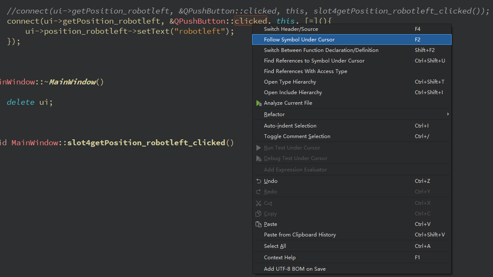

# Qt Creator的一些使用技巧

## 如何快捷地找到函数、变量的定义

对于代码：

```cpp
MainWindow::MainWindow(QWidget *parent)
    : QMainWindow(parent)
    , ui(new Ui::MainWindow)
{
    ui->setupUi(this);

    connect(ui->getPosition_robotleft, &QPushButton::clicked, this, [=](){
        ui->position_robotleft->setText("robotleft");
    });

}
```

如何才可以快速查看connect调用中的`&QPushButton::clicked`的定义呢？

很简单，鼠标右击它`clicked`：



点击`follow Symbol Under Cursor`即可跳转到定义页面：

`qabstractbutton.h`

```cpp
Q_SIGNALS:
    void pressed();
    void released();
    void clicked(bool checked = false);
    void toggled(bool checked);
```

可见这时Qt定义好的信号量`clicked(bool checked = false)`
