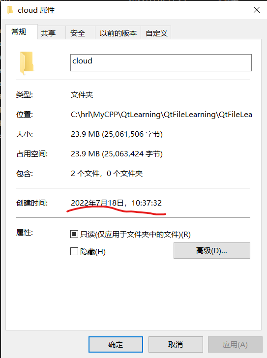

# QFileInfo

这个类是Qt专门用来获取文件的信息的

## 如何获取文件的大小

主要是使用了`QFileInfo::size()`接口来获取
返回值是文件所占磁盘控件的Bytes数

使用例子如下：

```cpp
// 获取 当前工作的路径
QString currentPath;
QDir dir;
currentPath = dir.currentPath();
std::string cloud_path = currentPath.toStdString() + "/cloud";
// 获取被测试文件的路径
std::string testfile_path = cloud_path + "/test.pcd";
// 获取被测试文件的信息
QFileInfo testfile_info(QString::fromStdString(testfile_path));
// 获取被测试文件的大小
qDebug() << "the size of testfile is: " << testfile_info.size() << endl;
```

**注意：**
如果是文件夹，那么返回值是0，即无法获取整个文件夹里所有文件大小
如果要获取文件夹的大小，只能遍历文件夹里所有文件，在通过这个方法获取文件夹里所有文件的大小并加起来。

## 获取文件所在的路径

### 获取文件所在的绝对路径

```cpp
// 获取文件所在的绝对路径（不包含文件自己的名字）
qDebug() << "the absolute path of file is: " << testfile_info.absolutePath() << endl;
    
// 获取文件所在的绝对路径（包含文件自己的名字）
qDebug() << "the absolute path of file is: " << testfile_info.absoluteFilePath() << endl;
```

## 获取文件的创建时间

```cpp
qDebug() << cloudfiles_info.birthTime().toString("yyyy-MM-dd-hh:mm:ss") << endl;
```

输出：

```bash
"2022-07-18-10:37:32"
```

从系统的资源管理器里进行查看：



## 获取文件作为QDir的绝对路径

```cpp
// 获取文件/文件夹作为QDir对象的绝对路径
qDebug() << testfile_info.absoluteDir() << endl;
```

## 获取文件的名字

```cpp
// 获取文件夹的文件名
qDebug() << cloudfiles_info.baseName() << endl;
qDebug() << testfile_info.baseName() << endl;
```

## 获取文件或者文件夹的创建时间

1. birthTime()
2. created()

```cpp
// 获取文件夹的创建时间
qDebug() << cloudfiles_info.birthTime().toString("yyyy-MM-dd-hh:mm:ss") << endl;

// or

// 获取文件创建时的日期和本地时间
// 这个和birthtime的区分？
qDebug() << cloudfiles_info.created().toString() << endl;
```

**注意**：
1. "yyyy"
2. "MM"

## 函数方法列表

```cpp
QFileInfo(const QFileInfo &fileinfo)
QFileInfo(const QDir &dir, const QString &file)
QFileInfo(const QFile &file)
QFileInfo(const QString &file)
QFileInfo()
QFileInfo &	operator=(QFileInfo &&other)
QFileInfo &	operator=(const QFileInfo &fileinfo)
~QFileInfo()
QDir	absoluteDir() const
QString	absoluteFilePath() const
QString	absolutePath() const
QString	baseName() const
QDateTime	birthTime() const
QString	bundleName() const
bool	caching() const
QString	canonicalFilePath() const
QString	canonicalPath() const
QString	completeBaseName() const
QString	completeSuffix() const
QDir	dir() const
bool	exists() const
QString	fileName() const
QString	filePath() const
QDateTime	fileTime(QFile::FileTime time) const
QString	group() const
uint	groupId() const
bool	isAbsolute() const
bool	isBundle() const
bool	isDir() const
bool	isExecutable() const
bool	isFile() const
bool	isHidden() const
bool	isJunction() const
bool	isNativePath() const
bool	isReadable() const
bool	isRelative() const
bool	isRoot() const
bool	isShortcut() const
bool	isSymLink() const
bool	isSymbolicLink() const
bool	isWritable() const
QDateTime	lastModified() const
QDateTime	lastRead() const
bool	makeAbsolute()
QDateTime	metadataChangeTime() const
QString	owner() const
uint	ownerId() const
QString	path() const
bool	permission(QFile::Permissions permissions) const
QFile::Permissions	permissions() const
void	refresh()
void	setCaching(bool enable)
void	setFile(const QString &file)
void	setFile(const QFile &file)
void	setFile(const QDir &dir, const QString &file)
qint64	size() const
QString	suffix() const
void	swap(QFileInfo &other)
QString	symLinkTarget() const
bool	operator!=(const QFileInfo &fileinfo) const
bool	operator==(const QFileInfo &fileinfo) const
```

## 参考链接

https://blog.csdn.net/vxueying/article/details/86715809
[Qt5官方文档](https://doc.qt.io/qt-5/qfileinfo.html)
[Qt6官方文档](https://doc.qt.io/qt-6/qfileinfo.html)
