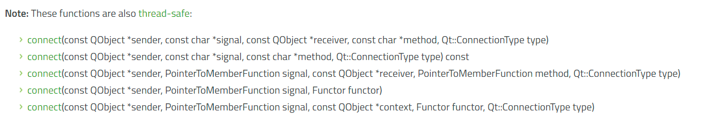

# Qt的信号-槽机制

## connect函数

connect函数有以下形式：



----

```cpp
connect(
    const QObject *sender, 
    const char *signal, 
    const QObject *receiver, 
    const char *method, 
    Qt::ConnectionType type
);

connect(
    const QObject *sender, 
    const char *signal, 
    const char *method, 
    Qt::ConnectionType type
) const;

connect(
    const QObject *sender, 
    PointerToMemberFunction signal, 
    const QObject *receiver, 
    PointerToMemberFunction method, 
    Qt::ConnectionType type
);

connect(
    const QObject *sender, 
    PointerToMemberFunction signal, 
    Functor functor
);

connect(
    const QObject *sender, 
    PointerToMemberFunction signal, 
    const QObject *context, 
    Functor functor, 
    Qt::ConnectionType type
);
```

### 1.sender, signal, receiver, method, type

```cpp
QMetaObject::Connection QObject::connect(
    const QObject *sender, 
    const char *signal, 
    const QObject *receiver, 
    const char *method, 
    Qt::ConnectionType type = Qt::AutoConnection
)
```

Creates a connection of the given type from the signal in the sender object to the method in the receiver object. Returns a handle to the connection that can be used to disconnect it later.

创建从发送方对象中的信号到接收方对象中的方法的给定类型的连接。返回连接的句柄，稍后可用于断开连接。

You must use the SIGNAL() and SLOT() macros when specifying the signal and the method, for example:

当指定信号和方法时，你必须使用SIGNAL()和SLOT()宏，例如:

```cpp
QLabel *label = new QLabel;
QScrollBar *scrollBar = new QScrollBar;

QObject::connect(
    scrollBar, 
    SIGNAL(valueChanged(int)),
    label,  
    SLOT(setNum(int))
);
```

This example ensures that the label always displays the current scroll bar value. Note that the signal and slots parameters must not contain any variable names, only the type. E.g. the following would not work and return false:

这个例子确保标签总是显示当前滚动条的值。
注意，信号和槽参数不能包含任何变量名，只能包含类型。例如，以下代码将无法工作并返回false:

```cpp
// WRONG
QObject::connect(
    scrollBar, 
    SIGNAL(valueChanged(int value)),
    label, 
    SLOT(setNum(int value))
);
```

A signal can also be connected to another signal:
一个信号也可以连接到另一个信号:

```cpp
class MyWidget : public QWidget
{
    Q_OBJECT

public:
    MyWidget();

signals:
    void buttonClicked();

private:
    QPushButton *myButton;
};

MyWidget::MyWidget()
{
    myButton = new QPushButton(this);
    connect(myButton, SIGNAL(clicked()),
            this, SIGNAL(buttonClicked()));
}
```

In this example, the MyWidget constructor relays a signal from a private member variable, and makes it available under a name that relates to MyWidget.

在本例中，MyWidget构造函数中继来自私有成员变量的信号，并使其在一个与MyWidget相关的名称下可用。

A signal can be connected to many slots and signals. Many signals can be connected to one slot.

一个信号可以连接到多个插槽和信号。一个插槽可以连接多个信号。

If a signal is connected to several slots, the slots are activated in the same order in which the connections were made, when the signal is emitted.

如果一个信号连接到几个插槽，当信号发出时，插槽按照连接建立的相同顺序被激活。
即按照connect定义的顺序依次执行

例如：

```cpp
MainWindow::MainWindow(QWidget *parent)
    : QMainWindow(parent)
    , ui(new Ui::MainWindow)
{
    ui->setupUi(this);

    // 实现按下按钮 和 按回按钮 执行不同的操作
    connect(ui->getPosition_robotleft, &QPushButton::clicked, this, [=](){
        if (ui->getPosition_robotleft->isChecked()) {
            ui->position_robotleft->setText("robotleft is true");
            qDebug()<<"true";
        }
        else {
            ui->position_robotleft->setText("robotleft is false");
            qDebug()<<"false";
        }
    });

    connect(ui->getPosition_robotleft, SIGNAL(clicked()), this, SLOT(slot4getPosition_robotleft_clicked()));
}

//
void MainWindow::slot4getPosition_robotleft_clicked()
{
    //QThread::msleep(2000);
    ui->position_robotleft->setText("robotleft is true");
    qDebug()<<"Myslot has been active.";
}
```

执行结果：
点击三次该按钮，qDebug打印如下：

```bash
true
Myslot has been active.
false
Myslot has been active.
true
Myslot has been active.
```

The function returns a QMetaObject::Connection that represents a handle to a connection if it successfully connects the signal to the slot. The connection handle will be invalid if it cannot create the connection, for example, if QObject is unable to verify the existence of either signal or method, or if their signatures aren't compatible. You can check if the handle is valid by casting it to a bool.

该函数返回一个QMetaObject::Connection，它表示一个连接的句柄，如果它成功地将信号连接到插槽。如果连接句柄不能创建连接，例如，如果QObject不能验证信号或方法的存在，或者它们的签名不兼容，则连接句柄将无效。你可以通过将句柄转换为bool类型来检查句柄是否有效。

By default, a signal is emitted for every connection you make; two signals are emitted for duplicate connections. You can break all of these connections with a single disconnect() call. If you pass the Qt::UniqueConnection type, the connection will only be made if it is not a duplicate. If there is already a duplicate (exact same signal to the exact same slot on the same objects), the connection will fail and connect will return an invalid QMetaObject::Connection.

Note: `Qt::UniqueConnections` do not work for lambdas, non-member functions and functors; they only apply to connecting to member functions.

The optional type parameter describes the type of connection to establish. In particular, it determines whether a particular signal is delivered to a slot immediately or queued for delivery at a later time. If the signal is queued, the parameters must be of types that are known to Qt's meta-object system, because Qt needs to copy the arguments to store them in an event behind the scenes. If you try to use a queued connection and get the error message

```cpp
QObject::connect: Cannot queue arguments of type 'MyType'
(Make sure 'MyType' is registered using qRegisterMetaType().)
```

call `qRegisterMetaType()` to register the data type before you establish the connection.

Note: This function is thread-safe.

See also `disconnect()`, `sender()`, `qRegisterMetaType()`, `Q_DECLARE_METATYPE()`, and Differences between String-Based and Functor-Based Connections.

### 2.sender, &signal, *receiver, &method, type

```cpp
QMetaObject::Connection QObject::connect(
    const QObject *sender, 
    const QMetaMethod &signal, 
    const QObject *receiver, 
    const QMetaMethod &method, 
    Qt::ConnectionType type = Qt::AutoConnection
)
```

Creates a connection of the given type from the signal in the sender object to the method in the receiver object. Returns a handle to the connection that can be used to disconnect it later.

The Connection handle will be invalid if it cannot create the connection, for example, the parameters were invalid. You can check if the QMetaObject::Connection is valid by casting it to a bool.

This function works in the same way as connect(const QObject *sender, const char *signal, const QObject *receiver, const char *method, Qt::ConnectionType type) but it uses QMetaMethod to specify signal and method.

This function was introduced in Qt 4.8.

See also connect(const QObject *sender, const char *signal, const QObject *receiver, const char *method, Qt::ConnectionType type).

QMetaObject::Connection QObject::connect(const QObject *sender, const char *signal, const char *method, Qt::ConnectionType type = Qt::AutoConnection) const
This function overloads connect().

Connects signal from the sender object to this object's method.

Equivalent to connect(sender, signal, this, method, type).

Every connection you make emits a signal, so duplicate connections emit two signals. You can break a connection using disconnect().

Note: This function is thread-safe.

See also disconnect().

### 3.

```cpp
template <typename PointerToMemberFunction> QMetaObject::Connection QObject::connect(const QObject *sender, PointerToMemberFunction signal, const QObject *receiver, PointerToMemberFunction method, Qt::ConnectionType type = Qt::AutoConnection)
```

This function overloads connect().

Creates a connection of the given type from the signal in the sender object to the method in the receiver object. Returns a handle to the connection that can be used to disconnect it later.

The signal must be a function declared as a signal in the header. The slot function can be any member function that can be connected to the signal. A slot can be connected to a given signal if the signal has at least as many arguments as the slot, and there is an implicit conversion between the types of the corresponding arguments in the signal and the slot.

Example:

QLabel *label = new QLabel;
QLineEdit *lineEdit = new QLineEdit;
QObject::connect(lineEdit, &QLineEdit::textChanged,
                 label,  &QLabel::setText);
This example ensures that the label always displays the current line edit text.

A signal can be connected to many slots and signals. Many signals can be connected to one slot.

If a signal is connected to several slots, the slots are activated in the same order as the order the connection was made, when the signal is emitted

The function returns an handle to a connection if it successfully connects the signal to the slot. The Connection handle will be invalid if it cannot create the connection, for example, if QObject is unable to verify the existence of signal (if it was not declared as a signal) You can check if the QMetaObject::Connection is valid by casting it to a bool.

By default, a signal is emitted for every connection you make; two signals are emitted for duplicate connections. You can break all of these connections with a single disconnect() call. If you pass the Qt::UniqueConnection type, the connection will only be made if it is not a duplicate. If there is already a duplicate (exact same signal to the exact same slot on the same objects), the connection will fail and connect will return an invalid QMetaObject::Connection.

The optional type parameter describes the type of connection to establish. In particular, it determines whether a particular signal is delivered to a slot immediately or queued for delivery at a later time. If the signal is queued, the parameters must be of types that are known to Qt's meta-object system, because Qt needs to copy the arguments to store them in an event behind the scenes. If you try to use a queued connection and get the error message

QObject::connect: Cannot queue arguments of type 'MyType'
(Make sure 'MyType' is registered using qRegisterMetaType().)
make sure to declare the argument type with Q_DECLARE_METATYPE

Overloaded functions can be resolved with help of qOverload.

Note: This function is thread-safe.

See also Differences between String-Based and Functor-Based Connections.

### 4.

```cpp
template <typename PointerToMemberFunction, typename Functor> QMetaObject::Connection QObject::connect(const QObject *sender, PointerToMemberFunction signal, Functor functor)
```

This function overloads connect().

Creates a connection from signal in sender object to functor, and returns a handle to the connection

The signal must be a function declared as a signal in the header. The slot function can be any function or functor that can be connected to the signal. A function can be connected to a given signal if the signal has at least as many argument as the slot. A functor can be connected to a signal if they have exactly the same number of arguments. There must exist implicit conversion between the types of the corresponding arguments in the signal and the slot.

Example:

void someFunction();
QPushButton *button = new QPushButton;
QObject::connect(button, &QPushButton::clicked, someFunction);
Lambda expressions can also be used:

QByteArray page = ...;
QTcpSocket *socket = new QTcpSocket;
socket->connectToHost("qt-project.org", 80);
QObject::connect(socket, &QTcpSocket::connected, [=] () {
        socket->write("GET " + page + "\r\n");
    });
The connection will automatically disconnect if the sender is destroyed. However, you should take care that any objects used within the functor are still alive when the signal is emitted.

Overloaded functions can be resolved with help of qOverload.

Note: This function is thread-safe.

### 5.

```cpp
template <typename PointerToMemberFunction, typename Functor> QMetaObject::Connection QObject::connect(const QObject *sender, PointerToMemberFunction signal, const QObject *context, Functor functor, Qt::ConnectionType type = Qt::AutoConnection)
```

This function overloads connect().

Creates a connection of a given type from signal in sender object to functor to be placed in a specific event loop of context, and returns a handle to the connection.

Note: Qt::UniqueConnections do not work for lambdas, non-member functions and functors; they only apply to connecting to member functions.

The signal must be a function declared as a signal in the header. The slot function can be any function or functor that can be connected to the signal. A function can be connected to a given signal if the signal has at least as many argument as the slot. A functor can be connected to a signal if they have exactly the same number of arguments. There must exist implicit conversion between the types of the corresponding arguments in the signal and the slot.

Example:

void someFunction();
QPushButton *button = new QPushButton;
QObject::connect(button, &QPushButton::clicked, this, someFunction, Qt::QueuedConnection);
Lambda expressions can also be used:

QByteArray page = ...;
QTcpSocket *socket = new QTcpSocket;
socket->connectToHost("qt-project.org", 80);
QObject::connect(socket, &QTcpSocket::connected, this, [=] () {
        socket->write("GET " + page + "\r\n");
    }, Qt::AutoConnection);
The connection will automatically disconnect if the sender or the context is destroyed. However, you should take care that any objects used within the functor are still alive when the signal is emitted.

Overloaded functions can be resolved with help of qOverload.

Note: This function is thread-safe.

This function was introduced in Qt 5.2.

## 信号

## 槽函数
