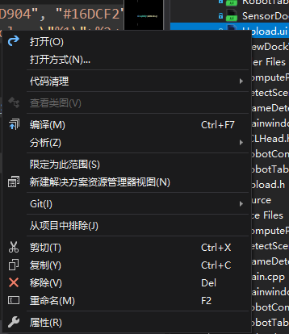

# Qt如何新建页面

这里以新建一个QDockWidget为例：

假设名字为MyDockWidget，那么需新建MyDockWidget.h, MyDockWidget.cpp, MyDockWidget.ui

大概内容为：

* MyDockWidget.h

```cpp
#pragma once

#include <QDockWidget>
#include "ui_MyDockWidget.h"

class MyDockWidget : public QDockWidget
{
	Q_OBJECT

public:
	MyDockWidget(QWidget *parent = Q_NULLPTR);
	~MyDockWidget();

public:

private:
	Ui::MyDockWidget ui;
};

```

* MyDockWidget.cpp

```cpp
#include "MyDockWidget.h"

using namespace hy;

MyDockWidget::MyDockWidget(QWidget *parent)
	: QDockWidget(parent)
{
	ui.setupUi(this);

}

MyDockWidget::~MyDockWidget()
{
}

```

然后编译的时候会报MyDockWidget没有ui成员之类的错误，这个时候需要直接编译.ui 文件

操作如下：


