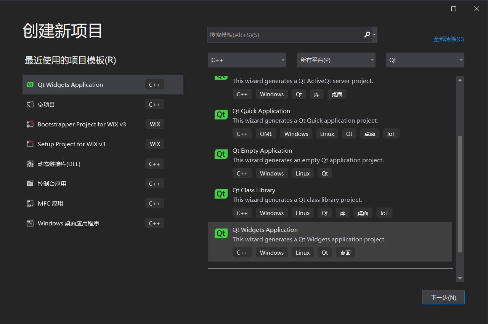
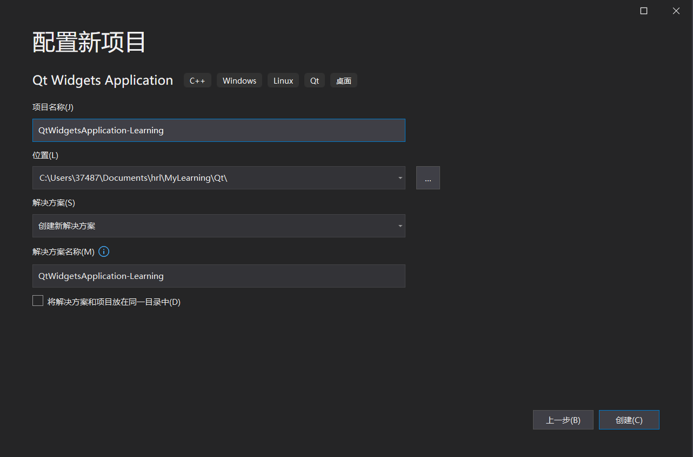
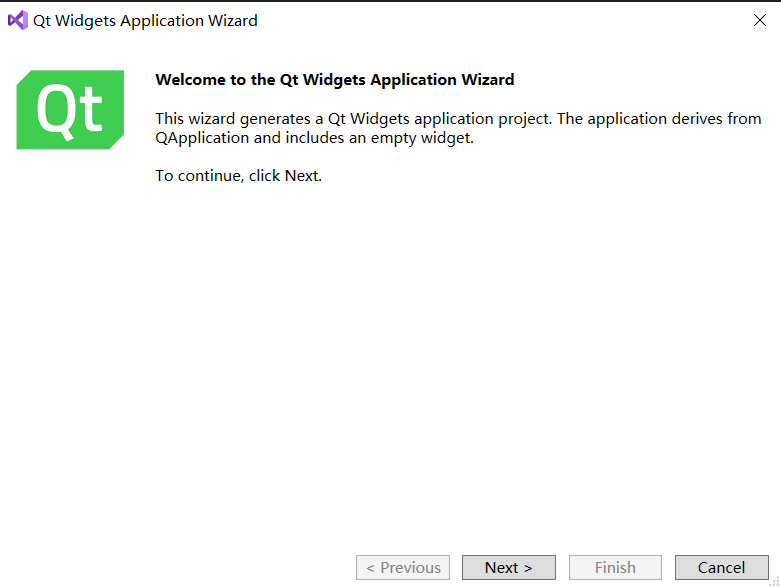
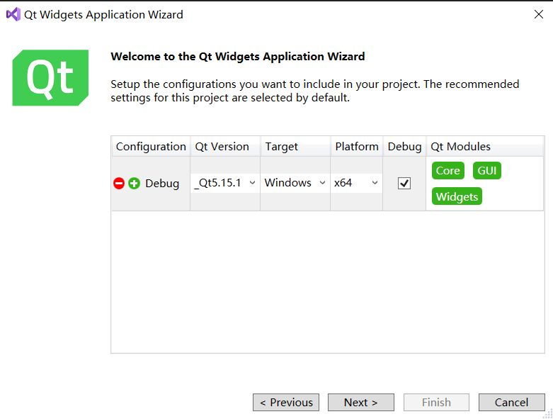
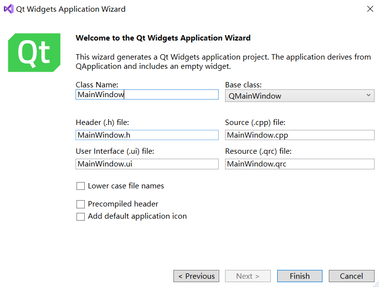
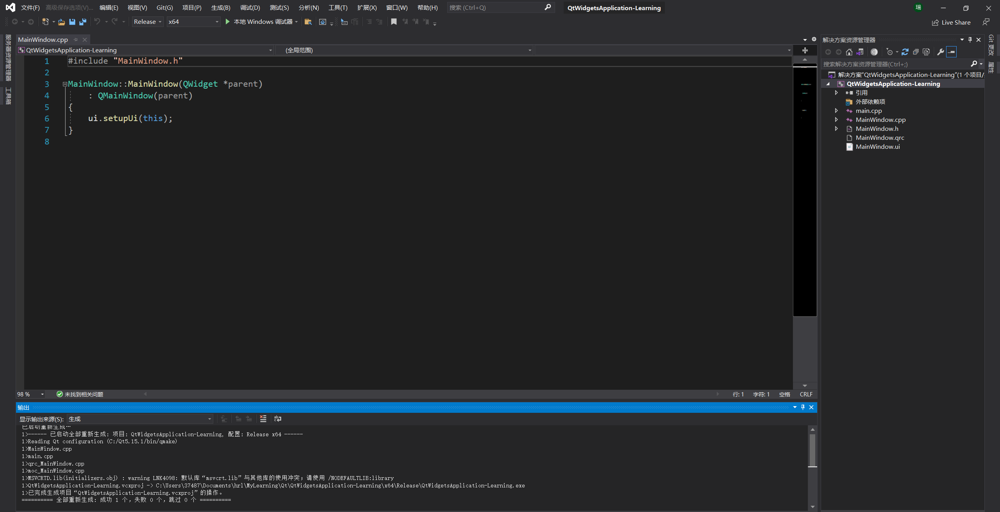
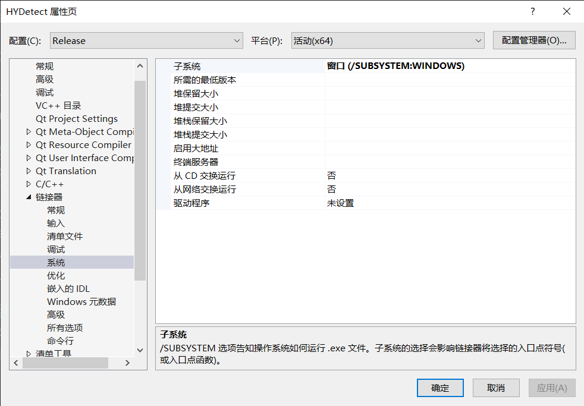

# visual studio开发调试Qt项目的常见问题

## 如何在visual studio里新建一个Qt项目

### 新建一个 Qt widget 项目

如图生成成功，就是新建项目成功了。如果有错误，依次排查即可。

## vs开发调试Qt项目没有控制台的解决办法

打开项目属性，找到来 链接器 系统：

将子系统改成“控制台”

## visual studio创建的Qt项目如何转换到Qt Creator打开

参考链接：

https://blog.csdn.net/zyhse/article/details/105391291?spm=1035.2023.3001.6557&utm_medium=distribute.pc_relevant_bbs_down_v2.none-task-blog-2~default~OPENSEARCH~Rate-1.pc_relevant_bbs_down_v2_default&depth_1-utm_source=distribute.pc_relevant_bbs_down_v2.none-task-blog-2~default~OPENSEARCH~Rate-1.pc_relevant_bbs_down_v2_default

