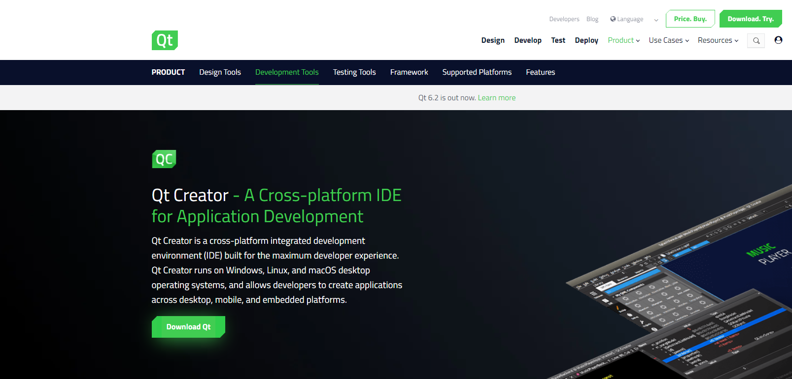
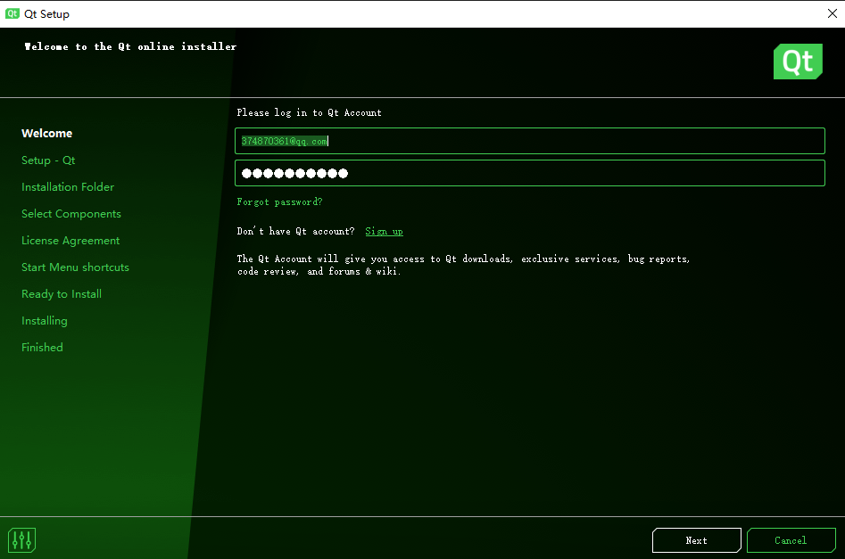
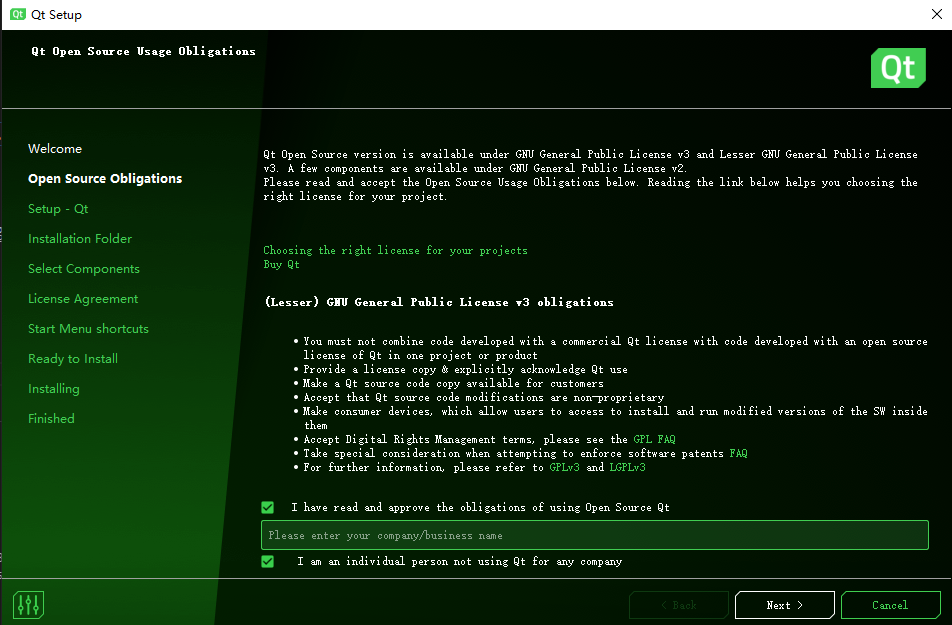
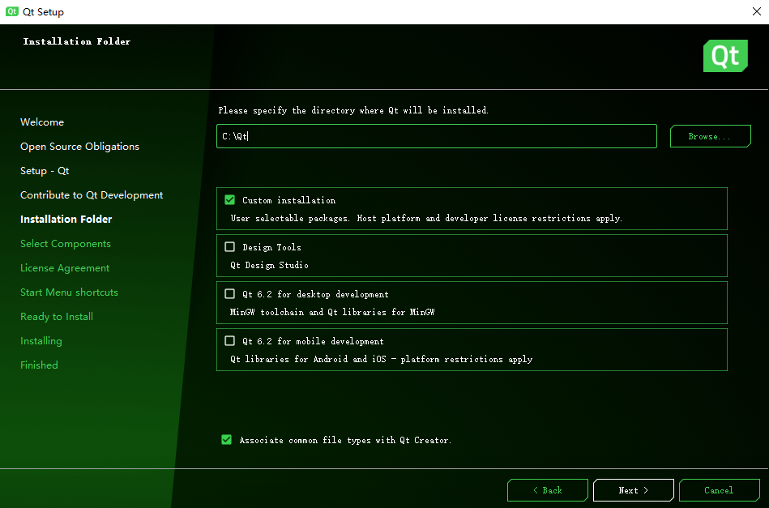

# 如何安装Qt

[官方下载地址][官方下载地址]

[官方下载地址]:https://www.qt.io/product/development-tools

点击**Download Qt**：

会下载一个
`qt-unified-windows-x86-4.1.1-online.exe`

1、打开后：

输入Qt的账户名和密码。

如果没有，就注册一个。

2、

将下面两个勾都勾上

3、

设置安装路径

建议选择自定义安装，即`Custom install`

4、
接下来就是根据自己的需要来选择要安装的组件了。
