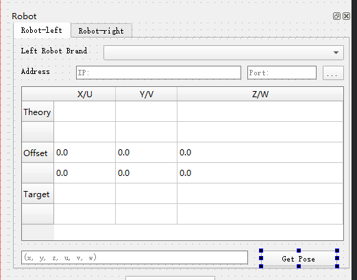
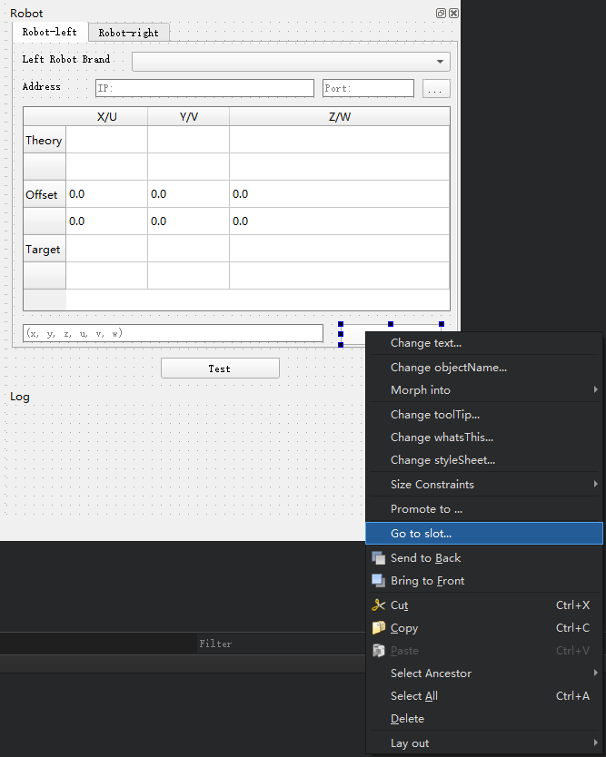
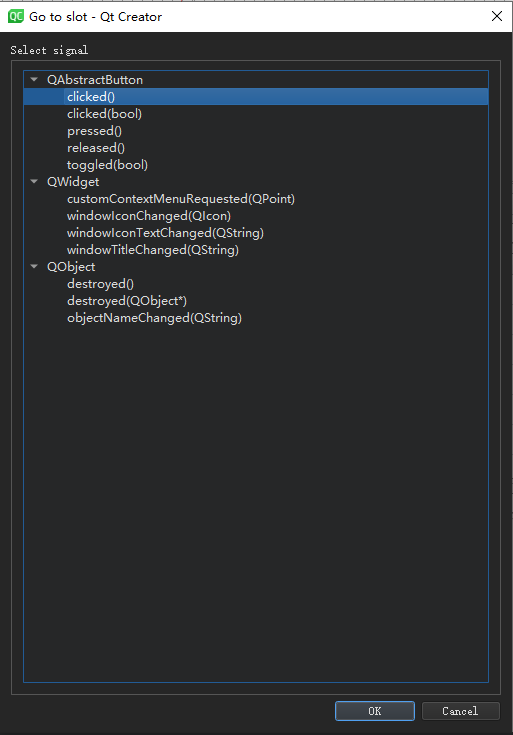
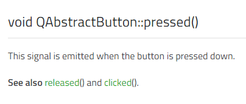
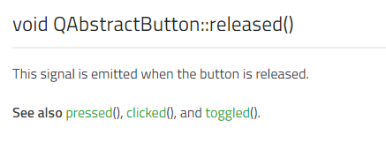
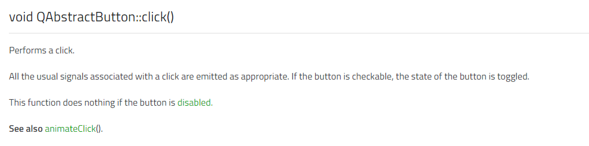
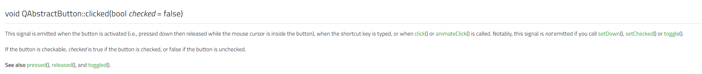
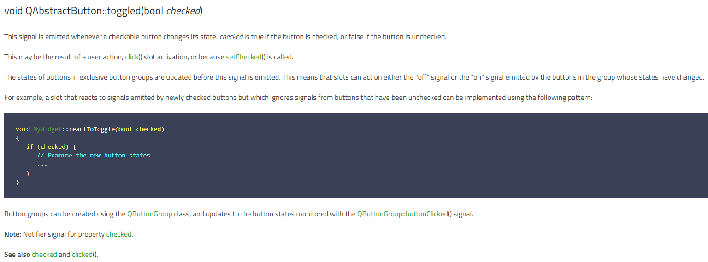

# QPushButton怎么用

最好在Qt Creator里定义好再到vs里编写具体的代码

假设我有个QPushButton “Get Pose”



这个Button我想每一次按它都会获取一次机器人当前的位姿，那这个怎么实现呢？

这时就会用到**信号-槽机制**

在Qt Creator里的Design页面右击这个按钮，找到`Go to slot`按钮就可以根据提示设置信号及其绑定的槽函数，十分方便：



## signal

点击`Go to slot`按钮之后就会看到：



我们需要在这里根据按钮的作用选择合适的信号，下面给出每个信号的文档：

### pressed



这个信号当按钮按下的时候就会emit

### released



这个信号当按钮按下之后松开的时候就会emit

### click



当按钮被点击（按下又松开）之后才会emit信号

### clicked



This signal is emitted when the button is activated (i.e., pressed down then released while the mouse cursor is inside the button), when the shortcut key is typed, or when click() or animateClick() is called. Notably, this signal is not emitted if you call setDown(), setChecked() or toggle().

If the button is checkable, checked is true if the button is checked, or false if the button is unchecked.

See also `pressed()`, `released()`, and `toggled()`.

当按钮被点击（按下又松开）之后，且这次点击导致按钮进入按下的状态时`bool checked = true`
否则，`bool checked = false`，默认`bool checked = false`

### toggled_signal



## 5种默认信号量的触发先后

写一段简单的代码就知道了

```cpp
    // 绑定 pressed 信号
    connect(ui->getPosition_robotleft, &QPushButton::pressed, this, [=](){
        qDebug()<<"this Button has been pressed!";
    });

    // 绑定 released 信号
    connect(ui->getPosition_robotleft, &QPushButton::released, this, [=](){
        qDebug()<<"this Button has been released!";
    });

    // 绑定 toggled 信号
    connect(ui->getPosition_robotleft, &QPushButton::toggled, this, [=](){
        qDebug()<<"this Button has been toggled!";
    });

    // 绑定 clicked 信号
    connect(ui->getPosition_robotleft, &QPushButton::clicked, this, [=](){
        if (ui->getPosition_robotleft->isChecked()) {
            ui->position_robotleft->setText("robotleft is true");
            qDebug()<<"true";
        }
        else {
            ui->position_robotleft->setText("robotleft is false");
            qDebug()<<"false";
        }
    });
```

输出结果如下：

```bash
this Button has been pressed!
this Button has been toggled!
this Button has been released!
true
```

可见：
先后顺序为：

pressed -> toggled -> released -> clicked

## 设计点击弹起和点击按下时进行不同的操作

关键在于如何使用`QPushButton::isChecked()`

这个功能有点类似`QCheckBox`

按下后`QPushButton::isChecked() = true`
再点击一次按钮弹起后`QPushButton::isChecked() = false`

```cpp
    // 实现按下按钮 和 按回按钮 执行不同的操作
    connect(ui->getPosition_robotleft, &QPushButton::clicked, this, [=](){
        if (ui->getPosition_robotleft->isChecked()) {
            ui->position_robotleft->setText("robotleft is true");
            qDebug()<<"true";
        }
        else {
            ui->position_robotleft->setText("robotleft is false");
            qDebug()<<"false";
        }
    });
```

