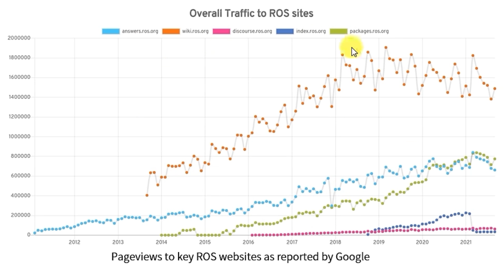

# About ROS

这是一个关于ROS的使用笔记。

## 关于ROS的介绍

https://blog.csdn.net/qq_25267657/article/details/84316111

## 关于ROS的思考

## 在哪里使用ROS

首先最困难的就是选择ROS装在哪个操作系统？

Linux？Win10？MacOS？docker官方镜像？

### docker官方镜像

优点：
1. 跨平台：哪个平台都能装
2. 安装方便：都帮你搞好来，拉下来就能用了

缺点：
1. win10使用不方便，想跑GUI得升级系统到Win11
2. MacOS Apple silicon芯片支持不好，跑不了GUI

### Win10

优点：
1. 可以装的设备多，手头win本多
2. GUI也有

缺点：
1. 安装复杂
2. 只能装 ROS2 某些功能不支持

### MacOS

优点：
1. GUI支持

缺点：
1. Apple silicon 芯片不支持（我凉了）
2. 安装复杂
3. 只能装 ROS2 某些功能不支持

### Linux

目前还是推荐现在Linux上跑ROS

## ROS版本的选择

目前只有ROS2是跨平台的支持win10、Linux、MacOS

推荐用ROS2

## ROS IDE选择

http://wiki.ros.org/IDEs

自己看着办吧

## ROS 学习的参考网站

