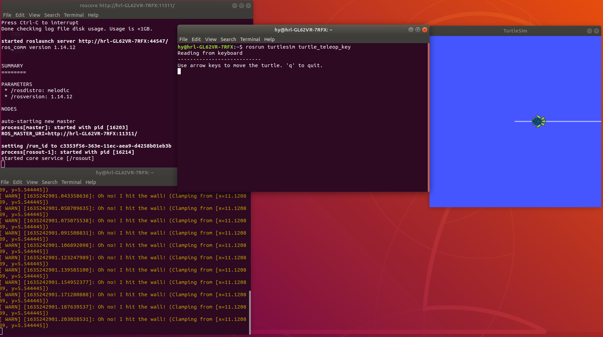
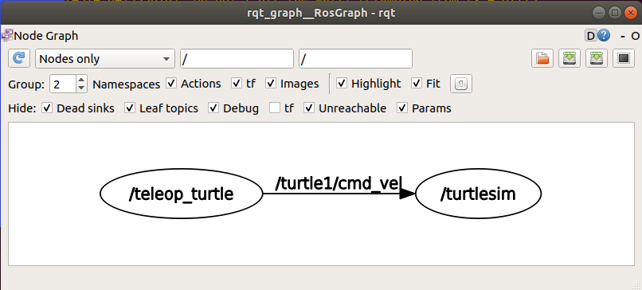

# ROS使用教程——分析乌龟例程

## 下载乌龟示例程序

```bash
sudo apt-get install ros-melodic-turtlesim
```

## 启动乌龟测试例程

1. 启动ros，运行命令：`roscore`
2. 新开一个终端 运行命令
   1. `rosrun turtlesim turtlesim_node`
3. 再新开一个终端 运行命令
   1. `rosrun turtlesim turtle_teleop_key`

结果如图：


## 乌龟例程中的Publisher与Subscriber

这时可以通过命令（可能仍然需要新开一个终端）：

```bash
rqt_graph
```

结果如图：


存在两个节点：

1. teleop_turtle
2. turtlesim

teleop_turtle节点创建了一个Publisher,用于发布键盘控制的速度指令

turtlesim节点创建了一个Subscriber，用于订阅速度指令，实现小乌龟在界面上的运动。

这里的话题是`/turtle1/cmd_vel`


